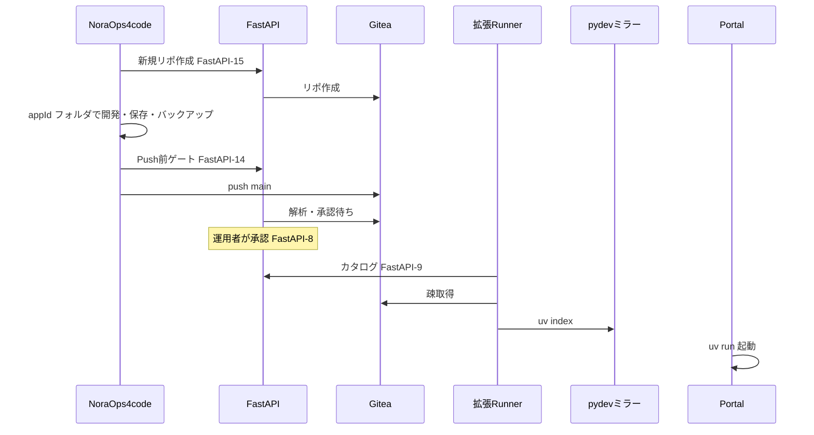

# NoraOps 設計の絞り込み（2026-05）

「完璧」より **スマートな機能部分がどこまで作れるか** を試すための、**製品の芯**だけを固定するメモ。  
既存の [前提と全体像.md](./前提と全体像.md)・[フェーズ進行.md](./フェーズ進行.md) は **実装の背骨**として残し、ここでは **見せ方・Git モデル・検証スコープ** を絞る。

---

## 1. システム構成（ユーザーが触る 3 つ）

| 名前（呼び名） | 中身 | 既存ドキュメント上の柱 |
|----------------|------|------------------------|
| **NoraOps4code** | VS Code 拡張 | ④ VS Code 拡張 |
| **Gitea** | アプリの正本（全部置く） | ① Gitea |
| **Runner**（拡張内・将来 Tauri） | 探す・実行する・通知を受ける入口 | 拡張 **Runner モード** ＋ ② の **公開向け API / HTML**（[ポータルとクライアント.md](./ポータルとクライアント.md)） |

**裏方（ユーザーは意識しないが必須）**: **FastAPI（NoraOps サーバ）**  
— Gitea 横断検索、承認カタログ、Push 前ゲート、拡張（Creator/Runner）への配布。  
**社内 PyPI ミラー（pydev）は後回し**（`FastAPI-16` は Phase2 以降）。  
「3 つ」は **UX の話**、「4 本柱」は **実装の話**、と割り切る。

**いま最優先**: [拡張UI設計.md](./拡張UI設計.md)（保存・履歴・リポ自動作成・チェックの画面）

```
  [開発者 PC]  NoraOps4code ──ローカル Git──► Gitea（正本）
                      │                           ▲
                      │                           │ REST
                      └──── FastAPI（頭脳）─────────┘
                                ▲
                                │ 承認済みカタログ / uv 引当 / ミラー
                    [拡張 Runner / 将来 Tauri]
```

---

## 2. サービスごとの「芯」（やること・やらないこと）

### 2.1 NoraOps4code（VS Code 拡張）

**ゴール**: 初心者が **Git 用語を知らなくても**、数か月後に同じアプリを開いて続けられる。

| やる | やらない（Phase1 の絞り） |
|------|---------------------------|
| 初回起動で **よく使う拡張を自動導入**（Python、Linter、Git History、Copilot 等は **manifest で列挙**、失敗しても本体は動く） | 全 IDE 設定の完全自動化 |
| **ボタン語彙**: 保存／履歴／戻す／復元／バックアップ（裏で commit・reflog・push） | ターミナルで `git` を叩かせる |
| **アプリ ID**（例: `nora.app.{slug}`）と **専用ワークスペース**（`%LOCALAPPDATA%/NoraOps/apps/{appId}/`） | リポジトリ名の自由入力を必須にしない |
| **`.gitignore` の自動生成・更新**（言語テンプレ＋ローカル秘密パターン） | ユーザーに ignore 編集を求めない |
| **main 一本**（下記 Git モデル） | ブランチ選択 UI、マージ、コンフリクト解消 UI |
| 承認済みカタログ・Push 前ゲートは **FastAPI 経由**（[責務と境界.md](./責務と境界.md)） | 拡張が Gitea に長期 PAT で直叩きし続ける |

**Git モデル（絞り込み版 — 既存フェーズ表との差分）**

| 項目 | 本ドキュメント（絞り） | [フェーズ進行.md](./フェーズ進行.md) 現行 |
|------|------------------------|------------------------------------------|
| ブランチ | **使わない**（常に `main`） | 作業ブランチ ＋ `main` 向け PR（VSCode-11/16） |
| マージ | **禁止**（UI に出さない） | PR 作成（自動マージは既定 OFF） |
| リモート同期 | **バックアップ**＝`commit` + `push origin main` | セーブ／リリースで段階分け |
| 履歴 | **ローカル reflog ＋ Gitea のコミット履歴**を「履歴」画面に | オートセーブは commit のみ push なし、等 |

**実装方針**: 裏では Portable Git を使うが、**ユーザー向け状態機械**は次の 4 操作に落とす。

1. **保存** — ディスク ＋ `git commit` ＋ **既定で `push`（Gitea）**。チェック未達でも実行
2. **（廃止）別バックアップ** — 保存に push を含めるため不要
3. **履歴** — コミット一覧から **この版に戻す**（`checkout` / 復元用ブランチを裏で一瞬作って即マージせず **単一コミット復元**でも可）
4. **戻す** — 直前の自動保存点へ（reflog）

> **注意**: `main` 直 push は Force や履歴改変と相性が悪い。**「戻す」はローカル優先**、共有したい版だけ **バックアップ**、と説明文で分ける。

**アプリ ID とフォルダ**

```text
%LOCALAPPDATA%/NoraOps/
  apps/
    {appId}/                 # 例: nora.app.invoice-helper
      workspace/             # 実作業ツリー（git root）
      meta.json              # 表示名、Gitea owner/repo、最終バックアップ、uv ロックの参照
  tools/                     # uv, portable-git（既存 manifest 流用）
```

`meta.json` が **「数か月後に開く」**ときの唯一の手がかり。拡張は **「前回の続き」**で `appId` を引く（[拡張フロー設計.md](./拡張フロー設計.md) の起動ゲートウェイと接続）。

---

### 2.2 Gitea

**ゴール**: アプリを **とにかく全部**置く。README で人間が読める。

| やる | Phase1 で後回し |
|------|-----------------|
| 全リポの Push / 履歴 / Release | Webhook 連動の自動再解析（Phase2: Gitea-3） |
| `README.md` / `README.html` の表示（ポータル・ダッシュ） | GitHub ミラー |
| **FastAPI 経由の横断検索**（名前・説明・トピック・README 先頭） | 全文ベクトル検索（F6） |

開発者向け一覧は **Gitea 上は全件**、利用者向け **Runner** は **承認済みのみ**（[前提と全体像.md](./前提と全体像.md)）— この二層は維持。

---

### 2.3 Runner（拡張内・将来 Tauri）

**ゴール**: **見つける → ワンクリック実行 → バージョン通知** が一本道。

| ステップ | 内容 | 連携 ID（目安） |
|----------|------|-----------------|
| 探す | **承認済みカタログ**検索（利用者）。運用者は Gitea 横断（②） | Client-1, FastAPI-9 |
| 実行 | 疎取得 → **`uv sync` / `uv run`**。索引は **社内ミラー** | Client-2, **FastAPI-16（新・下記）** |
| 運用 | 新 Release / 承認版の **通知**（Runner 常駐想定） | FastAPI-8, Client-6（新・下記） |

**社内 PyPI ミラー（pydev）**

- パッケージの **権威**: FastAPI 上の **ミラーインデックス**（Simple API 互換 or uv の `--index-url` 向け）。
- **取得元**: 初回だけ管理者が選んだ upstream（社内に既にある PyPI プロキシでも可）を **サーバが同期**；クライアントは **外部 pypi.org に直接行かない**（ポリシーで `UV_INDEX_URL` を固定）。
- **スコープ**: Phase1 は **承認済みアプリの `pyproject.toml` に載った依存**＋プラットフォームが許可したパッケージリスト。**任意 pip install は Runner 外**。

| 新 ID | 名前 | フェーズ | 内容 |
|-------|------|----------|------|
| **FastAPI-16** | 社内 PyPI ミラー（pydev） | Phase1（薄く） | `GET /simple/{package}/` 相当、許可リスト、監査ログ |
| **Client-6** | バージョン通知 | Phase2（薄く） | 前回実行した `appId@version` とカタログ差分を表示 |

---

## 3. 「スマート機能」検証スコープ（完璧にしない）

**目的**: 純粋に **賢い部分の開発品質** を測る。インフラ完遂は Phase1 コアの **縦スライス 1 本**で足りる。

### 3.1 検証したい「スマート」（優先順）

| # | 機能 | 何が「賢い」か | 最小実装 | 既存 ID |
|---|------|----------------|----------|---------|
| S1 | Push 前ゲート | 不足ファイルを **理由付きで列挙**＋雛形挿入 | `LICENSE` + `pyproject.toml` の 2 ルールだけ | FastAPI-14, VSCode-13 |
| S2 | 横断検索 | 「似たアプリある？」を **キーワードで返す** | README 先頭 + リポ名の TF 風スコア | FastAPI-3 の一部, 将来 FastAPI-11 |
| S3 | フロー＋チェックリスト | 次に何をするか **1 画面** | FLOW-NEW の 5 ステップだけ | VSCode-8 |
| S4 | オートセーブ＋バックアップ語彙 | Git を隠して **失敗しにくい** | 保存／バックアップの 2 ボタン | VSCode-15 を簡略化 |
| S5 | クラウドに送る＋ポリシー | 共有前チェックリスト | LICENSE 1 ルール | VSCode-13, FastAPI-14 |
| ~~S5b~~ | ~~ミラー経由 uv~~ | **後回し** | — | FastAPI-16, Client-2 |

**今回のスプリントで「よし」とするライン（例）**

- 新規アプリ 1 本を **NoraOps4code** から作り、**バックアップ**まで行える。
- **Runner**（拡張）から同じアプリを **ミラー経由 uv** で起動できる。
- **運用者**が承認すると Runner カタログにだけ出る（FA の薄い版で可）。

### 3.2 あえて後回し（検証を汚さない）

- AI（FastAPI-12/13）— 既定 OFF のまま UI も非表示
- GitHub プロバイダ（Git-1）
- ブランチ／PR／マージ UI
- テレメトリ・監査の本番運用（イベント 1〜2 種だけ送るなら可）
- 類似リポのベクトル検索

---

## 4. 既存フェーズ表への反映方針

1. **背骨は [フェーズ進行.md](./フェーズ進行.md) のまま**（承認・カタログ・uv・Sec）。
2. **Git UX** は本書の **main 一本**を **「初心者プロファイル」** として追記する（上級者プロファイルでブランチ／PR を復活させられる余地は残す）。
3. **FastAPI-16 / Client-6** はフェーズ表に行追加する（下記は [フェーズ進行.md](./フェーズ進行.md) に追記済み想定）。
4. 製品名 **NoraOps4code** は配布物名（.vsix）のマーケ名としてよい。コード上は `vscode-extension` のままでも可。

---

## 5. 1 枚のデータ流れ（検証用 Happy Path）



---

## 6. オープンな決めごと（実装前に 1 行ずつ決める）

| 論点 | たたき台 |
|------|----------|
| `main` 直 push の権限 | Gitea で **保護ブランチは使わず**、Force push 禁止だけサーバ側フック or ポリシーで |
| 履歴の「戻す」がリモートに及ぶか | **ローカルのみ**。共有はバックアップのみ |
| 承認なしリポを Runner が見られるか | **見えない**（現行方針維持） |
| Copilot 等の自動導入 | manifest に **オプション**扱い（オフライン環境ではスキップ） |

---

*この文書は「絞り」のたたき台。実装チケットは引き続き [フェーズ進行.md](./フェーズ進行.md) の ID をコピペする。*
