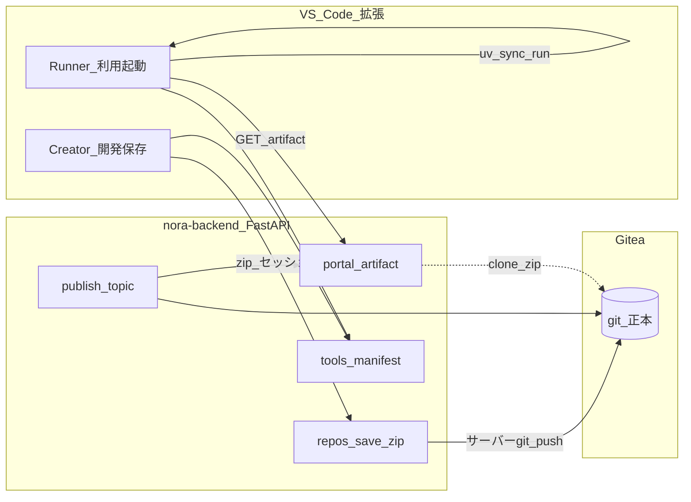

<!-- doc-meta: status=現行 | canonical=yes | updated=2026-06-24 -->

# NoraOps 現状とアーキテクチャ（2026-06 時点）

**製品像**: [製品像とロードマップ.md](./製品像とロードマップ.md) — ガードレール（主）+ Creator/Runner（副）+ 横断監査（サーバー）  
**正本の実装**: `vscode-extension/`（v0.17+）、`nora-backend/`、Gitea（オリジナル運用）  
**任意**: 社内 PyPI（pypiserver 別プロセス）— [pypiserver 連携設定書](../nora-backend/docs/pypiserverサービス連携設定書兼仕様書.md)

---

## 1. 三層構成

**任意（pypiserver 有効時）**: 拡張 `uv` → 社内 simple index（`NORAOPS_PYPI_INDEX_URL`）→ ミラー dir。許可リスト・`deps_audit` は nora-backend。詳細は連携設定書。

| 層 | 役割 | ユーザーが見るもの |
|----|------|-------------------|
| **Gitea** | ソースの git 正本・履歴 | （原則 URL / PAT を見せない） |
| **FastAPI** | 認証集約・zip 受信・artifact 生成・カタログ・ツール配布 | `noraops.server.baseUrl` のみ必須 |
| **拡張** | Creator + Runner UI、uv、ローカルキャッシュ | NoraOps ホーム / Runner パネル |

---

## 2. 「拡張で git しない」思想

### やっていること

| 操作 | 経路 |
|------|------|
| Creator 保存 | ワークスペース zip → `POST /api/v1/repos/save` → **サーバー**が解凍・`git push`（`GITEA_TOKEN`） |
| Runner 起動 | `GET /api/v1/portal/apps/{owner}/{name}/artifact` → 展開 → **クライアント uv** |
| 公開 | `POST /api/v1/repos/publish` → topic + サーバーでソース zip 事前生成 |
| 保存先の決定 | **`.nora/session.json` の `giteaFullName` のみ**（v0.5.4+。古い `.git` origin は使わない）→ **改定予定**: AppData `workspaces/` + `giteaRepoId`（[ワークスペース設計改定.md](./ワークスペース設計改定.md)） |

### 拡張に残る git の用途（限定的）

- 新規リポ作成時の **表示用** `origin` URL（認証なし）
- **履歴パネル**（ローカル git log）— 将来 zip 履歴に寄せる余地あり
- **foreign git 検出**（別プロジェクトの `.git` 残骸を警告）

### メリット

- ユーザーに **Gitea PAT / Credential Helper を出さない**
- トークン・push 権限を **サーバー `.env` に集約**
- Runner は **clone 不要**（HTTP + uv のみ）
- 保存先を **NoraOps 登録情報で固定**し、無関係リポへの push を防止

### デメリット・注意

- サーバーに **git 実行環境**が必須
- 毎回フル zip で **やや重い**（500人・低同時想定で許容）
- ローカル `.git` が残っていると **混乱しやすい**（警告で緩和）
- `%LOCALAPPDATA%\NoraOps\venvs` と `runner-apps` が **溜まりやすい**（後述 UX 課題）

---

## 3. 機能一覧（拡張）

| 機能 ID | モード | 説明 | 主モジュール |
|---------|--------|------|--------------|
| F-save | Creator | チェック → 起動ファイル指定 → zip 保存 | `savePipeline`, `serverSave` |
| F-provision | Creator | 新規 Gitea リポ作成 + session 登録 | `repoSetup`, `noraopsApi` |
| F-publish | Creator | 保存後 topic `nora-published` | `saveFlow` → `publish` |
| F-runner-catalog | Runner | 公開アプリ一覧 | `catalogClient`, `portal_api` |
| F-runner-run | Runner | artifact + uv + GUI 起動 | `artifactRunner` |
| F-runner-edit | Runner→Creator | 同一 artifact を開発フォルダへ | `openAppForEdit` |
| F-tools | 共通 | uv（必須）/ git（任意）配布 | `toolInstaller` |
| F-checks | Creator | セキュリティ・ポリシー（**ガードレール主機能**） | `checkRunner` |
| F-python | Creator/Runner | uv venv + **パッケージ許可 warn**（**ガードレール主機能**） | `pythonEnv`, `packageAllowlist` |
| F-repo-audit | サーバー | Gitea 全リポ横断チェック（拡張と同エンジン） | `repo_audit_service` |

バックエンド API 一覧: [機能一覧とAPI.md](./機能一覧とAPI.md)

---

## 4. ユーザー操作動線（確認済み）

### A. 開発 → 利用（初回）

1. フォルダを開く（Creator）
2. **保存** → 起動ファイルを選ぶ → **新規 Gitea リポジトリを作成して保存**
3. **アプリを使う**（Runner）→ カタログに表示 → 起動
4. **ソースを編集** → 開発用コピーを開く
5. 修正 → **保存（登録済みリポ）** → 再度 Runner で起動

### B. 保存メニューの分岐

| 状態 | 表示される選択肢 |
|------|----------------|
| NoraOps 未登録 | 新規リポ作成 / ローカルのみ（＋ 古い git があれば警告） |
| 登録済み | `Gitea に保存（owner/name）` / バージョン上げ / ローカルのみ |

---

## 5. ローカルデータの置き場（要 UX 改善）

| パス | 内容 | 課題 |
|------|------|------|
| `%LOCALAPPDATA%\NoraOps\venvs\` | Runner/Creator ごとの uv venv | **試すたびに増える** |
| `%LOCALAPPDATA%\NoraOps\runner-apps\` | 公開アプリの artifact 展開 | **アプリ数分たまる** |
| `%LOCALAPPDATA%\NoraOps\dev-apps\` | 「ソースを編集」用コピー | 同上 |
| `%LOCALAPPDATA%\NoraOps\runtime\` | uv.exe 等 | 通常 1 セット |
| ワークスペース `.nora\session.json` | 保存先リポ・メタ | 正本の紐づけ |

**望ましい UX（今後）**

- 試用終了 → **環境もソースもまとめて削除**
- 気に入ったら **両方キープ**、あとから削除可能
- 容量・最終利用日・お気に入りを **一覧表示**
- 削除候補の **レコメンド**

---

## 6. 動作確認とテスト

詳細・チェック項目一覧・メンテ方針 → **[テストと動作確認.md](./テストと動作確認.md)**

| 種類 | 誰向け | やり方 |
|------|--------|--------|
| **スモーク（GUI）** | 運用・公開しながら開発 | 拡張「動作確認」/ ポータル TOP → NoraOps 動作確認 |
| **ユニットテスト** | 開発・CI | `npm test` / `pytest tests/` |
| **手動 E2E** | リリース前 | [縦通し体験手順.md](./縦通し体験手順.md) |

---

## 7. 今後の実装ステップ（優先度案）

| 優先 | 項目 |
|------|------|
| P0 | Runner/Creator **ストレージ管理 UI**（一覧・容量・削除） |
| P0 | 保存/Runner **フロー図を拡張 UI に常設**（迷子防止） |
| P1 | venv **1 アプリ 1 安定 venv**（再利用・古い venv TTL） |
| P1 | artifact キャッシュ **TTL / 手動削除** |
| P2 | 承認 DB（公開ゲートの本実装） |
| P2 | `POST /repos/push` bundle API **削除** |
| P3 | 履歴パネルを git から **サーバー履歴**へ |

---

## 8. 関連ドキュメント

| 資料 | 用途 |
|------|------|
| [製品像とロードマップ.md](./製品像とロードマップ.md) | 製品の一言・ロードマップ |
| [機能一覧とAPI.md](./機能一覧とAPI.md) | API・モジュール対応表 |
| [縦通し体験手順.md](./縦通し体験手順.md) | 手動デモ手順 |
| [vscode-extension/docs/MODULES.md](../vscode-extension/docs/MODULES.md) | 拡張コードの境界 |
| [nora-backend/docs/app-artifact-contract.md](../nora-backend/docs/app-artifact-contract.md) | 公開アプリ契約 |
| [実装記録.md](./実装記録.md) | 時系列メモ |

旧資料（構想・Phase1 絞り込み）は参照用。矛盾時は **本書と実装記録を優先**。
