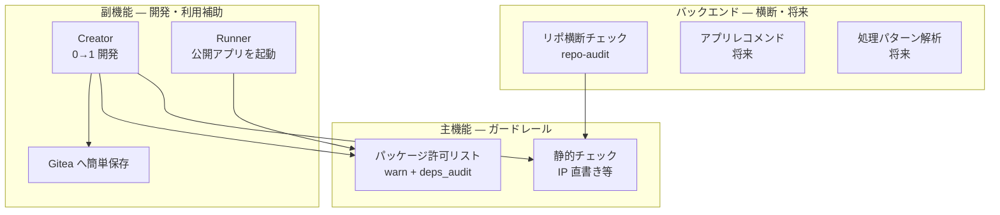

<!-- doc-meta: status=現行 | canonical=yes | updated=2026-06-24 -->

# NoraOps 製品像とロードマップ

**NoraOps** は、社内 Python / VS Code 開発における **安心な開発環境のガードレール** です。  
「止めすぎない」監査と warn を軸に、Creator / Runner で 0→1 開発と利用を補助します。

---

## 1. 一言で

| 軸 | 内容 |
|----|------|
| **守る** | 静的チェック（IP 直書き等）・パッケージ許可リスト（warn + 監査） |
| **助ける** | Creator（開発・保存）・Runner（公開アプリの起動）・Gitea 連携 |
| **見える化** | サーバー横断のリポ監査・未許可パッケージの審査キュー |
| **これから** | 既存アプリのレコメンド・処理パターン解析・ベースコード提案 |

---

## 2. 機能の位置づけ

### 2.1 主機能（ガードレール）

| 機能 | 実装 | 挙動 |
|------|------|------|
| **IP 直書き制限** | 拡張 `checkRunner` + `security.rules.json` | ソース内の公衆 IP・172.*・192.168.* 等を検出（warn / ブロックはルール次第） |
| **パッケージチェック** | `packageAllowlist.js` + `/admin/packages` | 環境作成前 **warn**（続行可）、`uv sync` 後 **deps_audit**、運用が XLSX で許可リスト管理 |

任意: 社内 PyPI（pypiserver）— [NoraOpsの導入.md](./NoraOpsの導入.md) §7

### 2.2 副機能（開発・利用補助）

| 機能 | 説明 |
|------|------|
| **Creator** | ワークスペース上で 0→1 開発。チェック → zip 保存 → Gitea 新規/更新 |
| **Gitea 保存** | 拡張は git push しない。zip → サーバーが `GITEA_TOKEN` で push |
| **Runner** | 公開済みアプリ（topic `nora-published`）をカタログから選び artifact + uv で起動 |

### 2.3 バックエンド（横断・分析）

| 機能 | 状態 | 説明 |
|------|------|------|
| **リポ横断チェック** | **実装済み** | 全 Gitea リポに対し拡張と同じチェックエンジンをサーバーから実行（`/admin` repo-audit） |
| **アプリレコメンド** | 将来 | 「こんなアプリ欲しい」→ 既存リポの候補提示（簡易キーワード → 横断検索へ発展） |
| **処理・機能の分解解析** | 将来 | 既存リポの共通パターン（@パターン）を抽出し、ベースコード提案 |

---

## 3. 三層構成（技術）

| 層 | パス | 役割 |
|----|------|------|
| **拡張** | `vscode-extension/` | Creator + Runner UI、静的チェック、uv、許可リスト warn |
| **API** | `nora-backend/` | 保存・artifact・許可リスト・認証・repo-audit・バックアップ |
| **Gitea** | 別ホスト | git 正本・公開 topic |

詳細: [現状とアーキテクチャ.md](./現状とアーキテクチャ.md)

---

## 4. ロードマップ（優先度案）

| 優先 | 項目 | 状態 |
|------|------|------|
| P0 | パッケージ許可リスト XLSX・審査キュー・メール付き audit | 実装済み（v0.17） |
| P0 | バックアップ / 復元 | 実装済み |
| P0 | email_token 認証 | 実装済み |
| P1 | Runner/Creator ストレージ管理 UI | 一部（storage パネル） |
| P1 | pypiserver 本番 NSSM + IIS | 手順書のみ |
| P2 | **アプリレコメンド**（カタログ + キーワード） | スタブ / 設計のみ |
| P2 | **処理パターン解析**（横断メトリクス → テンプレ提案） | 未着手 |
| P3 | 承認 DB（公開ゲート本実装） | 未着手 |

バックログ詳細: [今後のUX改善.md](./今後のUX改善.md)

---

## 5. 関連ドキュメント

| 資料 | 用途 |
|------|------|
| [機能一覧とAPI.md](./機能一覧とAPI.md) | API・コマンド一覧 |
| [NoraOpsの導入.md](./NoraOpsの導入.md) | 初回セットアップ |
| [認証モードとGitea運用.md](./認証モードとGitea運用.md) | 認証 |
| [ポリシーチェックルール.md](./ポリシーチェックルール.md) | sec/pol ルール |
| [実装記録.md](./実装記録.md) | リリース履歴 |

旧構想（レコメンド詳細・横断解析 F 番号等）は [archive/](./archive/) にあります。**実装判断は本書とコードを優先**してください。
