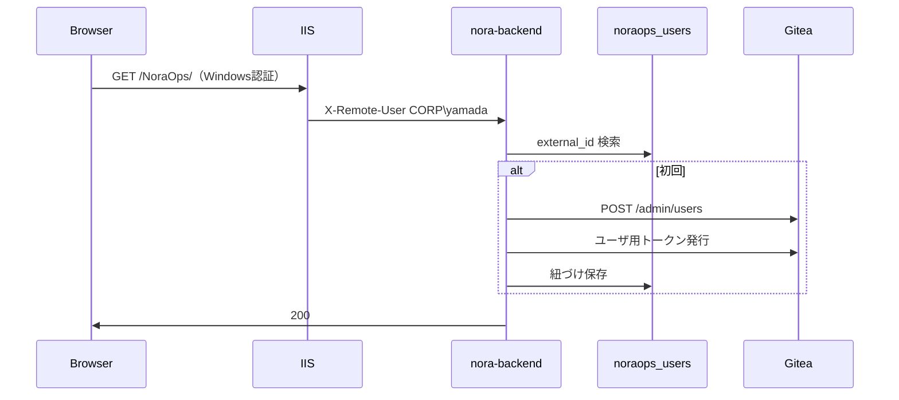
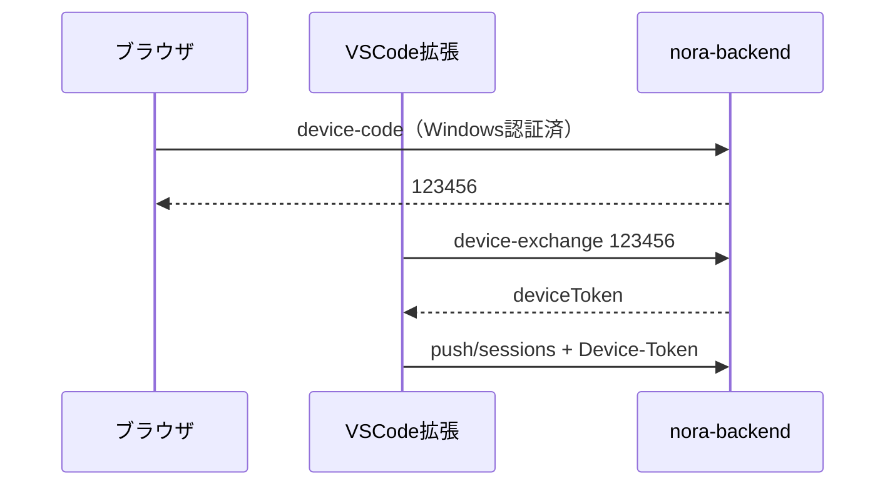

# 認証モードと Gitea 運用（運営者向け）

NoraOps（nora-backend）と Gitea を、**Windows Server + IIS 認証**を前提に、ユーザーごとの個人リポで運用するための設定書です。

> 実装状況: `NORAOPS_AUTH_MODE` により `open`（開発）、`windows_trust`（本番 IIS）、`email_otp`（メール OTP + スライディングセッション）を切り替えます。拡張（VS Code）は IIS の Windows 認証を自動では通らないため、**デバイス登録コード**（windows_trust）または **メール OTP ログイン**（email_otp）で紐づけます。

---

## 1. 前提

| コンポーネント | 役割 |
|----------------|------|
| **IIS + ARR** | 社内向け HTTPS、`/NoraOps` サブパス、**Windows 認証** |
| **nora-backend** | API・ユーザー登録・zip 保存・Runner カタログ |
| **Gitea** | git 正本。リポは **個人**（`ユーザー名/リポ名`） |
| **NoraOps4code 拡張** | Creator / Runner（保存はサーバー経由 zip が既定） |

関連: [IIS-ARR配備.md](./IIS-ARR配備.md)、[サーバー接続設定.md](./サーバー接続設定.md)、[Giteaリポジトリ要件.md](./Giteaリポジトリ要件.md)

---

## 2. 認証モード一覧（`.env`）

| `NORAOPS_AUTH_MODE` | 説明 | 想定環境 |
|---------------------|------|----------|
| **`open`**（既定） | IIS ユーザーを信頼しない。push セッションは誰でも取得可（開発） | ローカル `127.0.0.1:8000` |
| **`windows_trust`** | IIS/ARR が認証したユーザーを `X-Remote-User` 等から取得。未認証は保護 API が 401 | 社内 IIS 本番 |
| **`email_otp`** | メール 6 桁 OTP + DB スライディングセッション（7 日無操作で再ログイン） | Windows 認証なし環境 |

### 補助変数

```env
# 認証モード（open | windows_trust | email_otp）
NORAOPS_AUTH_MODE=open

# IIS が転送するユーザーヘッダ（優先順で最初に見つかったものを使用）
NORAOPS_TRUSTED_USER_HEADER=X-Remote-User

# Windows 初回ログイン時の verified email（AD mail 等）
NORAOPS_TRUSTED_EMAIL_HEADER=X-Remote-Email

# email_otp 用（NORAOPS_AUTH_MODE=email_otp 時）
# NORAOPS_SMTP_HOST=smtp.corp.example.com
# NORAOPS_OTP_TTL_MINUTES=10
# NORAOPS_SESSION_IDLE_DAYS=7
# NORAOPS_SESSION_ABSOLUTE_DAYS=30

# 初回ログイン時に Gitea ユーザを自動作成（1=有効）
NORAOPS_GITEA_AUTO_PROVISION=1

# 仮メール: {gitea_login}@{ドメイン}
NORAOPS_GITEA_EMAIL_DOMAIN=noreply.example.local

# ユーザ PAT 保存用（本番では長いランダム文字列を設定）
NORAOPS_USER_TOKEN_SECRET=change-me-in-production

# windows_trust 時、拡張が push セッションを取る前にデバイス登録が必要
# （ポータルでコード発行 → 拡張で入力）
```

---

## 3. IIS の設定手順（Windows 認証）

### 3.1 サーバーの役割

1. **サーバーマネージャー** → 「役割と機能」→ **Windows 認証** をインストール（未導入の場合）。
2. **IIS マネージャー** → 対象サイト（または `/NoraOps` アプリケーション）。

### 3.2 認証の有効化

| 項目 | 設定 |
|------|------|
| **匿名認証** | **無効** |
| **Windows 認証** | **有効** |

社内 PC（AD 参加済）では、多くの場合 **ログオンプロンプトなし**で通過します。  
社外・スマホではドメイン資格情報の入力が求められます。

### 3.3 ARR でユーザ名を FastAPI に渡す

リバースプロキシの **サーバー変数**（ARR で許可が必要）:

| 変数 | 例 |
|------|-----|
| `HTTP_X_REMOTE_USER` | `CORP\yamada` または `yamada@corp.example.com` |
| または `HTTP_REMOTE_USER` | 同上 |

`web.config` の rewrite で FastAPI（uvicorn）へプロキシする際、上記が付与されるよう IIS/ARR を設定してください。  
**uvicorn を外部に直公開しない**こと（ヘッダ偽装対策）。

詳細は [IIS-ARR配備.md](./IIS-ARR配備.md) を参照。

---

## 4. 初回ログイン → Gitea 自動作成



| 項目 | 内容 |
|------|------|
| 識別子 | `DOMAIN\username` を `external_id` として正規化 |
| Gitea login | ドメインなしのユーザ名（衝突時はサフィックス） |
| メール | LDAP 未使用時は `{login}@NORAOPS_GITEA_EMAIL_DOMAIN` |
| パスワード | ランダム（利用者は Gitea UI ログイン不要・API トークンのみ） |

確認: ブラウザで `GET /api/v1/noraops/auth/me`（`windows_trust` 時）→ `giteaLogin` が返る。

---

## 5. 拡張（VS Code）の接続 — デバイス登録

拡張の HTTP クライアントは **SPNEGO を送らない**ため、IIS Windows 認証だけでは保存 API が 401 になります。

### 手順

1. **社内 PC のブラウザ**で NoraOps ポータルにアクセス（Windows 認証でログイン済み）。
2. `POST /api/v1/noraops/auth/device-code`（管理画面または API クライアント）で **6 桁コード**を発行（5 分有効）。
3. VS Code で **「NoraOps: デバイス登録」** を実行し、コードを入力。
4. 拡張が `deviceToken` を保存し、以降 `push/sessions` に `X-NoraOps-Device-Token` を付与。



---

## 6. Gitea リポの置き方（個人リポ正本）

| 項目 | 方針 |
|------|------|
| オーナー | **ログインユーザの Gitea login**（Organization ではない） |
| 新規作成 | Creator が保存・provision すると `自分/login/リポ名` |
| Runner 公開 | リポに topic **`nora-published`**（既定。`NORAOPS_PUBLISHED_TOPIC` で変更可） |
| コンシェルジュ | **自分が見えるリポ**の範囲で類似検索（名前・Gitea 説明欄のみ） |
| README 本文 | 類似度には **未使用**（将来拡張可） |

### 推奨 `GITEA_LIST_MODE`（個人運用）

```env
GITEA_LIST_MODE=scoped
GITEA_ORGS=
GITEA_TOKEN=<サイト管理者またはサービス用PAT>
```

- 一覧 API は、認証ユーザがいる場合 **そのユーザの PAT** で `/user/repos` を取得（件数が少ない）。
- 管理者 PAT は **ユーザ自動作成・管理者操作**用。

---

## 7. 保存経路（zip + サーバー push）

| 方式 | 既定 | 説明 |
|------|------|------|
| **zip → FastAPI → git push** | **はい** | 秘密情報スキャン・manifest 整合。ユーザ PAT で push |
| **拡張 → SSH 直 Gitea** | 非推奨 | ポリシー迂回。上級者向け将来オプション |

共有 `GITEA_TOKEN` は段階的に **管理者専用**（全ユーザの git 代行ではなく）へ移行します。

---

## 8. Organization を使うべきか

| 方式 | 向いているケース |
|------|------------------|
| **個人リポ（本書の正本）** | 誰が作ったか明確、権限が Gitea 標準のまま |
| **1 Organization に全員** | 全社一覧を org 単位で見たい（Team で権限） |
| **instance 横断** | 管理者ダッシュボードのみ。一般 Creator には非推奨 |

現行の推奨は **個人リポ** です。全社検索が必要になったら **管理者モード** または Gitea Team を別途検討。

---

## 9. メール・LDAP（将来）

| 課題 | 当面の対策 |
|------|------------|
| Gitea はメール必須 | 仮メール `{login}@noreply.{社内ドメイン}` |
| 本物のメールを使いたい | AD/LDAP の `mail` を Gitea LDAP 連携で同期（Gitea 側設定） |
| NoraOps `ldap` モード | 将来。IIS 以外のクライアント向け API 認証 |

---

## 10. セキュリティチェックリスト

- [ ] uvicorn は **127.0.0.1** のみ listen（外向きは IIS のみ）
- [ ] `NORAOPS_AUTH_MODE=windows_trust` は本番 IIS のみ
- [ ] `NORAOPS_USER_TOKEN_SECRET` を本番用に変更
- [ ] Gitea 管理者 PAT はサーバー `.env` のみ（拡張に渡さない）
- [ ] 開発 PC では `open`、本番では `windows_trust`

---

## 11. トラブルシュート

| 症状 | 確認 |
|------|------|
| ポータルが 401 | IIS Windows 認証・匿名 OFF |
| `/auth/me` が `user: null` | `X-Remote-User` が ARR で付与されているか |
| Gitea ユーザが作られない | `NORAOPS_GITEA_AUTO_PROVISION=1`、`GITEA_TOKEN` が管理者権限か |
| 拡張が push できない | `windows_trust` 時は **デバイス登録**済みか / `email_otp` 時は **メール OTP ログイン**済みか |
| Runner にアプリが出ない | topic `nora-published` または dev の `NORAOPS_CATALOG_DEV_SHOW_ALL=1` |
| 他人のリポが見える | `GITEA_LIST_MODE=instance` になっていないか確認 |

---

## 12. 実装フェーズ（開発者向け）

| Phase | 内容 |
|-------|------|
| A | 本ドキュメント・`.env.example` |
| B | `windows_trust` ミドルウェア、`noraops_users`、Gitea 自動 provision |
| C | リポ owner / 一覧をログインユーザに限定 |
| D | 保存時にユーザ PAT で git push |
| E | デバイス登録 + 拡張コマンド |
| F | `canonical_user_id` + `noraops_identities`、email_otp、スライディングセッション、Windows メール自動リンク |

---

## 13. 引き越し・サービス終了

**原則: 正本は Git、NoraOps DB は付帯情報**

| 資産 | 正本 | 引き越し方法 |
|------|------|-------------|
| アプリソース | Gitea リポ | `git clone --mirror` → 新ホストへ `git push --mirror` |
| ローカル作業コピー | ワークスペース `nora/` | フォルダコピー or 上記 clone |
| appId ↔ リポ | `nora_app_registry` | manifest の `appId` が真。DB は再登録可 |
| サムネ | `nora/assets/thumbnail.png` | リポ内ファイル |
| Runner artifact | サーバー `artifacts/` | 再 publish で再生成可 |

### ユーザー向け

1. ログイン後 `GET /api/v1/noraops/me/repos/export` で自分の clone URL 一覧を取得
2. 各リポを `git clone --mirror <cloneUrl>` で取得
3. 新 Gitea で空リポを用意し `git push --mirror` で移行

拡張コマンド「NoraOps: メール OTP ログイン」後、保存・Runner が利用可能（`email_otp` 時）。

### 運営者向け

- 既存の自動バックアップ（`NORAOPS_BACKUP_*`）で Gitea repos + data/ を定期取得
- Gitea 公式の移行手順（設定・DB）も併用可
- Windows 切替で canonical が統合されればリポ owner は変更不要。統合できなかった場合は Gitea 管理画面で repo transfer

---

*最終更新: 認証モード・個人リポ連携実装に合わせて作成*
