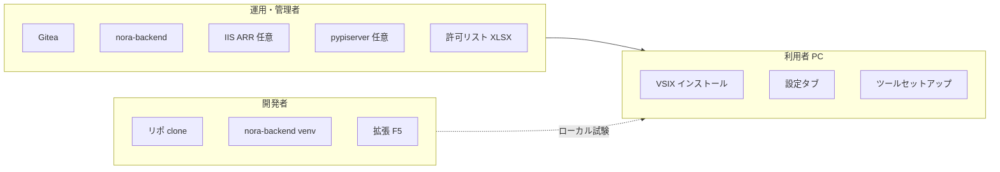
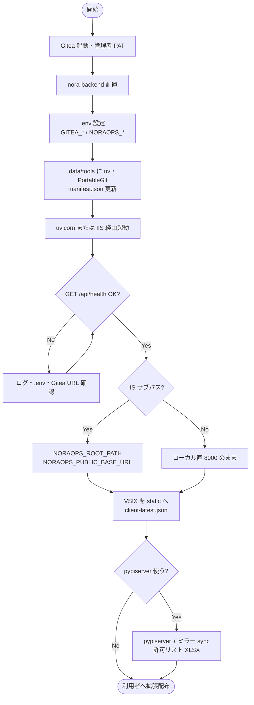
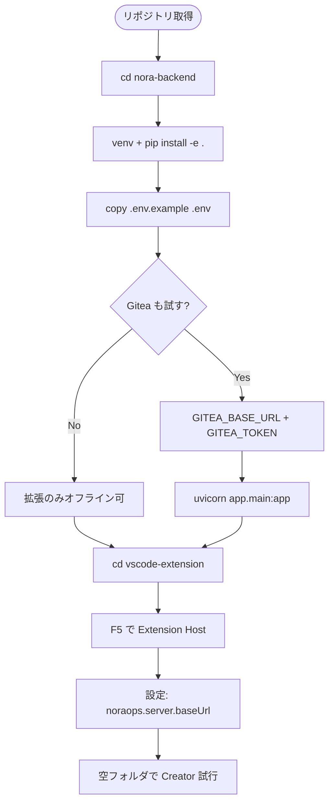
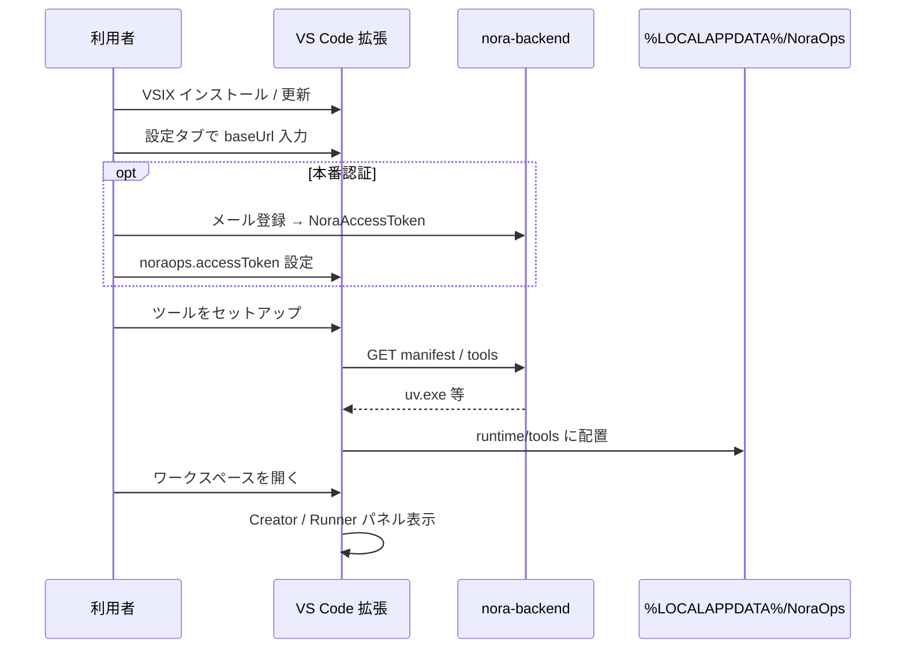

# 01 — セットアップフロー

> **優しいメモ**: 「全部いっぺんに」やらなくて大丈夫です。**開発だけ**なら拡張 + ローカル API だけでも動きます。本番は段階的に足していくイメージで OK です。

---

## 1. 誰が何をセットアップするか

| 役割 | 最低限必要 | あると便利 |
|------|------------|------------|
| **運用** | Gitea、`nora-backend`、`.env` | IIS サブパス、社内 PyPI、バックアップ |
| **開発** | Python 3.11+、Node（テスト用）、VS Code | 同梱 `uv.exe`、`Gitea` ローカル |
| **利用者** | 拡張 + `noraops.server.baseUrl` | NoraAccessToken（本番認証） |

---

## 2. 本番セットアップ（運用）の流れ

**メモ（よくある順序ミス）**

- pypiserver は **`.env` だけでは動かない** → ミラー sync で `mirror/` に wheel が必要
- ツール配布は **manifest の sha256** が実ファイルと一致していること
- 本番認証は `NORAOPS_AUTH_MODE=email_token` が推奨（詳細: [認証モードとGitea運用.md](../../NoraOps/認証モードとGitea運用.md)）

**編集・参照先**

| やること | 見る場所 |
|----------|----------|
| 環境変数一覧 | `nora-backend/.env.example` |
| 導入手順の正本 | [NoraOpsの導入.md](../../NoraOps/NoraOpsの導入.md) |
| IIS | [IIS-ARR配備.md](../../NoraOps/IIS-ARR配備.md) |
| PyPI | [pypiserver 連携設定書](../../nora-backend/docs/pypiserverサービス連携設定書兼仕様書.md) |

---

## 3. 開発者セットアップの流れ

**メモ**

- チェックルールはサーバーがいなくても拡張同梱 JSON にフォールバックします
- 保存・Gitea 連携を試すなら **API + Gitea 両方**が必要
- 手順の細部: [開発時用の動作手順書.md](../../NoraOps/開発時用の動作手順書.md)

---

## 4. 利用者 PC の初回セットアップ

**メモ**

- 利用者に **Gitea PAT は渡さない**（サーバー側 `GITEA_TOKEN` のみ）
- Python 環境作成時に **許可リスト warn** が出ることがある（続行可 → サーバーに audit）

---

## 5. 本番前チェックリスト（短縮版）

| # | 項目 | 確認方法 |
|---|------|----------|
| 1 | API 生存 | `GET /api/health` |
| 2 | Gitea 接続 | 管理画面 or diagnostics |
| 3 | ツール配布 | `GET /api/tools/windows-x64/manifest.json` |
| 4 | 拡張更新情報 | `GET /api/v1/noraops/client/latest` |
| 5 | 認証モード | `.env` の `NORAOPS_AUTH_MODE` |
| 6 | バックアップ | `NORAOPS_BACKUP_ENABLED`（任意） |

詳細: [NoraOpsの導入.md](../../NoraOps/NoraOpsの導入.md) · [MAINTENANCE.md](../MAINTENANCE.md)
