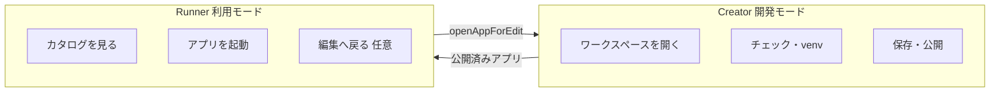
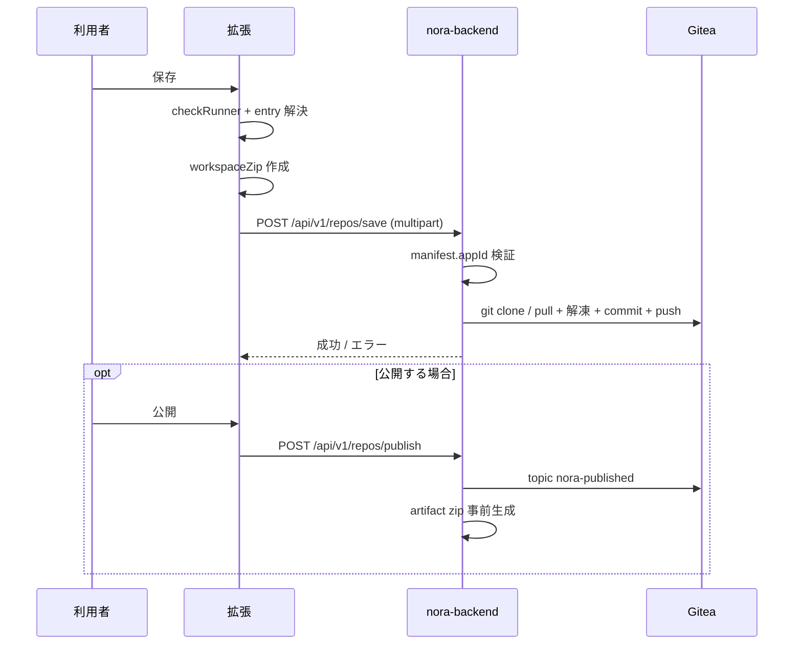
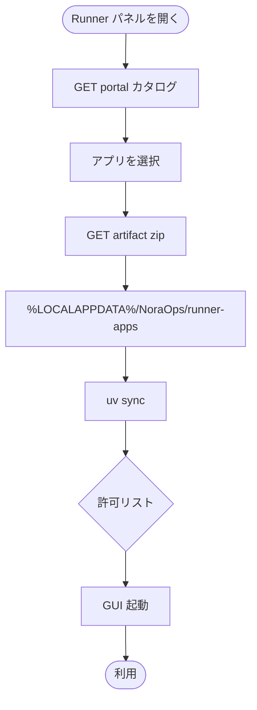
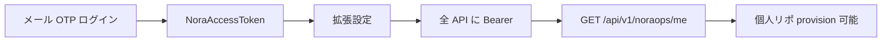

# 02 — ユーザ利用フロー

> **優しいメモ**: NoraOps の「主役」は **ガードレール**（チェック・許可リスト）です。Creator（作る）と Runner（使う）はその上に乗る副機能、と覚えると全体像がブレません。  
> 製品像の正本: [製品像とロードマップ.md](../../NoraOps/製品像とロードマップ.md)

---

## 1. 利用者が見る 2 つのモード



| モード | いつ使う？ | 主な UI |
|--------|------------|---------|
| **Creator** | Python アプリを書いて保存したい | NoraOps ホームパネル |
| **Runner** | 公開されたアプリを起動したい | Runner パネル |

**メモ**: 設定 `noraops.mode` で既定を切り替え可能。どちらも同じ拡張です。

---

## 2. Creator — 初回（新規アプリ）の流れ


**メモ（ユーザーが意識しないこと）**

- zip は **拡張が作り、サーバーが解凍して git push** します
- 保存先は `.nora/session.json` の `giteaFullName`（将来 AppData 移行予定）
- チェック失敗時は **保存ボタンが止まる**＝ガードレールの核心

---

## 3. Creator — 保存・公開のシーケンス



**編集するときは**

- 拡張: `savePipeline.js`, `serverSave.js`, `saveFlow.js`
- サーバー: `repo_save.py`, `repo_provision.py`, `app_registry_service.py`

---

## 4. Runner — アプリ起動の流れ



**メモ**

- Runner は **git clone しない**（HTTP で artifact のみ）
- キャッシュが溜まる → 将来のクリーンアップ UX 課題（[現状とアーキテクチャ.md](../../NoraOps/現状とアーキテクチャ.md) 参照）

---

## 5. ガードレール（主機能）の利用フロー

```mermaid
flowchart TB
  subgraph client [拡張・保存前]
    CR[checkRunner<br/>セキュリティ・ポリシー]
    PA[packageAllowlist<br/>uv add / sync 時]
  end
  subgraph server [サーバー・横断]
    DA[deps_audit 記録]
    RA[repo-audit 夜間/手動]
    ADM[/admin/packages 許可リスト]
  end
  CR -->|ルール取得| Rules[GET /api/v1/noraops/checks/rules]
  PA -->|照会| PKG[GET /api/v1/noraops/packages/allowlist]
  PA -->|違反報告| DA
  ADM --> PKG
  RA --> Gitea[(Gitea 全リポ)]
  RA --> CR
```

| タイミング | 何が起きる？ | ユーザー体験 |
|------------|--------------|--------------|
| 保存前 | `checkRunner` | エラーなら保存不可 |
| `uv add` 等 | 許可リスト warn | 続行可、サーバーに記録 |
| 夜間（任意） | repo-audit | 利用者は非同期、管理者が結果確認 |

---

## 6. 認証がある本番環境での利用



**メモ**: 認証なし開発時は `NORAOPS_AUTH_MODE=none`。詳細は [認証モードとGitea運用.md](../../NoraOps/認証モードとGitea運用.md)。

---

## 7. 困ったときの分岐（利用者サポート用）

| 症状 | まず疑うところ |
|------|----------------|
| 保存できない | チェック結果パネル、起動ファイル未指定 |
| サーバー接続エラー | `baseUrl`、IIS サブパス、ファイアウォール |
| パッケージ warn | 許可リスト — 管理者に申請 |
| Runner にアプリがない | 未公開 or カタログ API |
| トークンエラー | NoraAccessToken 期限・再ログイン |

診断 UI: 拡張のヘルスチェック · サーバー `/diagnostics`
