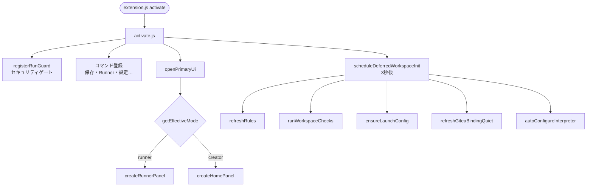
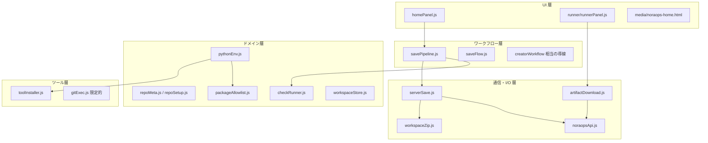
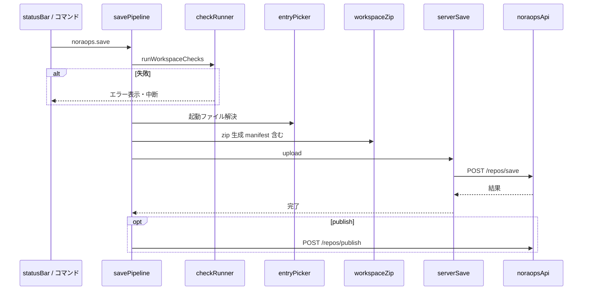
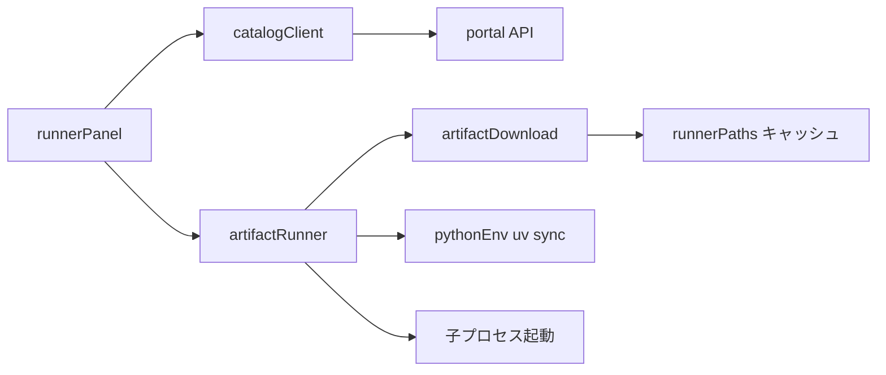
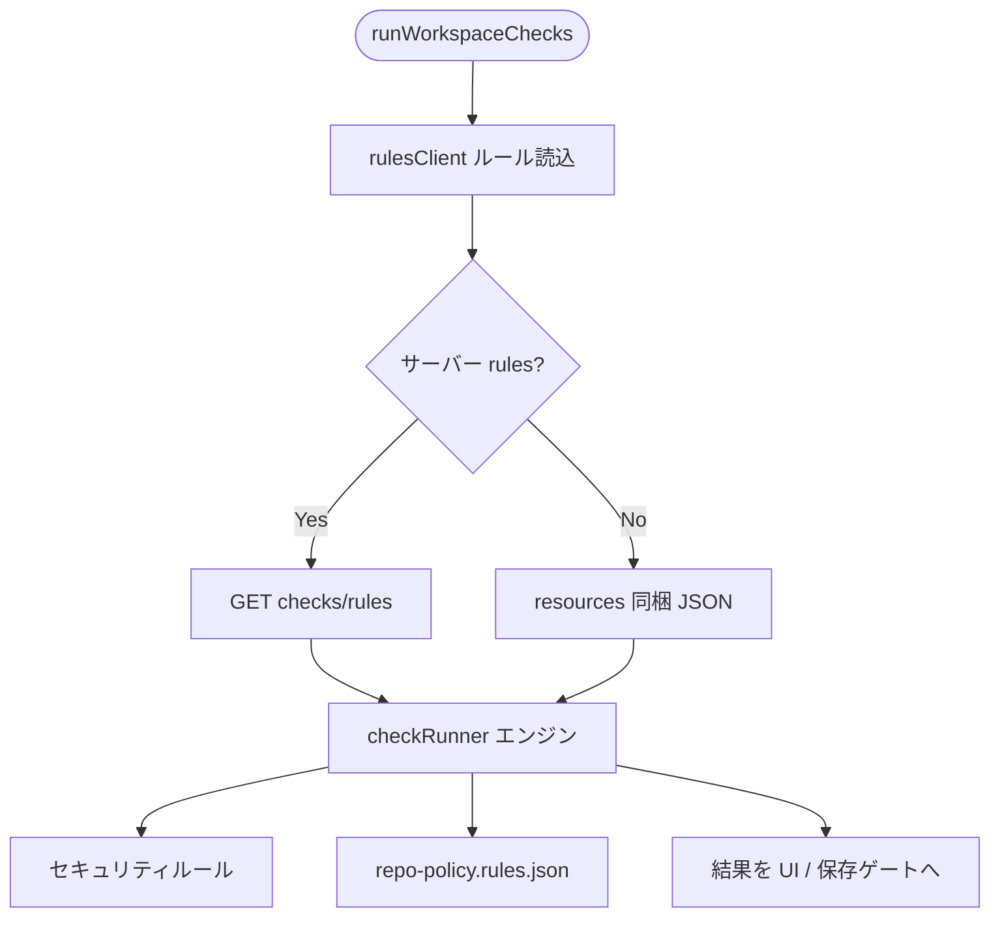
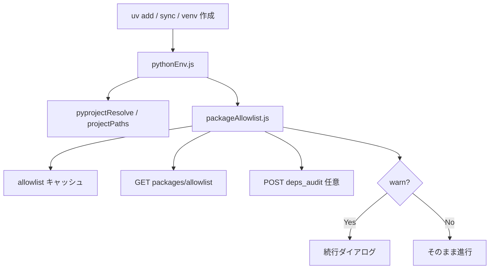
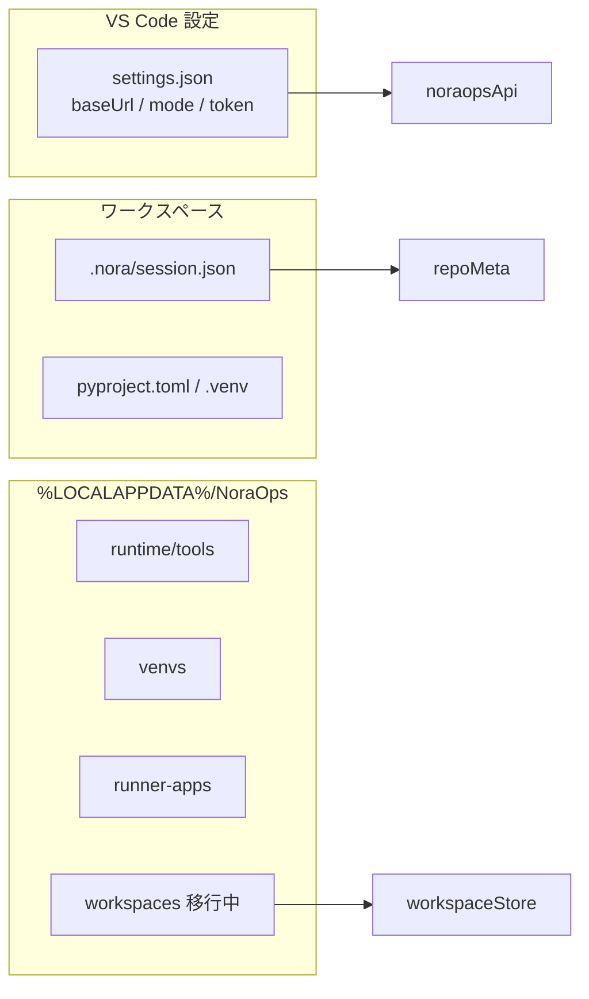

# 03 — VS Code 拡張の内部機能フロー

> **優しいメモ**: 入口は **1 本だけ** — `src/extension.js` → `noraops/activate.js`。ここから枝分かれします。  
> ファイル一覧の正本: [MODULES.md](../../vscode-extension/docs/MODULES.md)

---

## 1. 拡張の起動（activate）の流れ



**メモ**

- 起動直後は UI だけ先に出し、**重い処理は 3 秒遅延**（VS Code の体感を優先）
- ワークスペースが無いときもホームは出る（新規作成導線）

**触るとき**: `vscode-extension/src/noraops/activate.js`

---

## 2. モジュールのレイヤ構造



---

## 3. Creator — 保存パイプライン（内部）



| 段階 | 主ファイル | 失敗しやすい点 |
|------|------------|----------------|
| チェック | `checkRunner.js`, `rulesClient.js` | ルール JSON 未取得 |
| 起動ファイル | `entryPicker.js`, `appEntry.js` | 複数候補・未指定 |
| zip | `workspaceZip.js`, `appIdentity.js` | `appId` / manifest |
| 送信 | `serverSave.js` | 認証・ネットワーク |

---

## 4. Runner — 起動パイプライン（内部）



**触るとき**: `vscode-extension/src/noraops/runner/`

---

## 5. チェック（checkRunner）の内部



**メモ**

- サーバーと拡張で **同じルール思想**（repo-audit もこのエンジン系を再利用）
- ルール変更時は [MAINTENANCE.md](../MAINTENANCE.md) の同期表を確認

---

## 6. Python 環境・許可リストの内部



**触るとき**: `pythonEnv.js`, `packageAllowlist.js`  
**サーバー側の対**: `nora-backend/app/noraops/routers/packages.py`

---

## 7. 設定・状態の保存場所



**メモ**: ワークスペース設計改定は [ワークスペース設計改定.md](../../NoraOps/ワークスペース設計改定.md)。Phase 1 は `workspaceStore.js` が中心。

---

## 8. 拡張を直すときのクイックガイド

| やりたいこと | まず開くファイル |
|--------------|------------------|
| ホーム UI | `homePanel.js`, `media/noraops-home.html` |
| 保存の流れ | `savePipeline.js` → `serverSave.js` |
| Gitea 紐づけ | `repoSetup.js`, `giteaBinding.js` |
| Runner 一覧・起動 | `runner/runnerPanel.js`, `artifactRunner.js` |
| 新コマンド追加 | `activate.js` + `package.json` contributes |
| サーバー URL / 認証 | `noraopsApi.js` |
| テスト | `vscode-extension/test/*.test.js` |

```powershell
cd vscode-extension
npm test
```

F5 デバッグ: [開発時用の動作手順書.md](../../NoraOps/開発時用の動作手順書.md)
