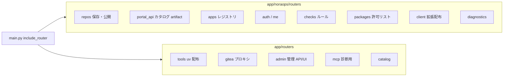
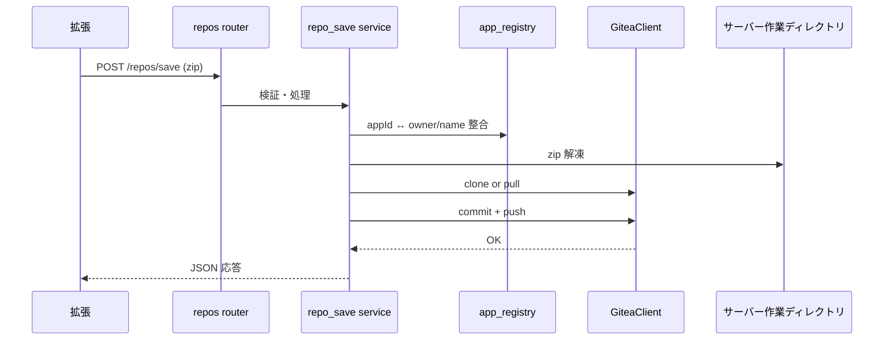
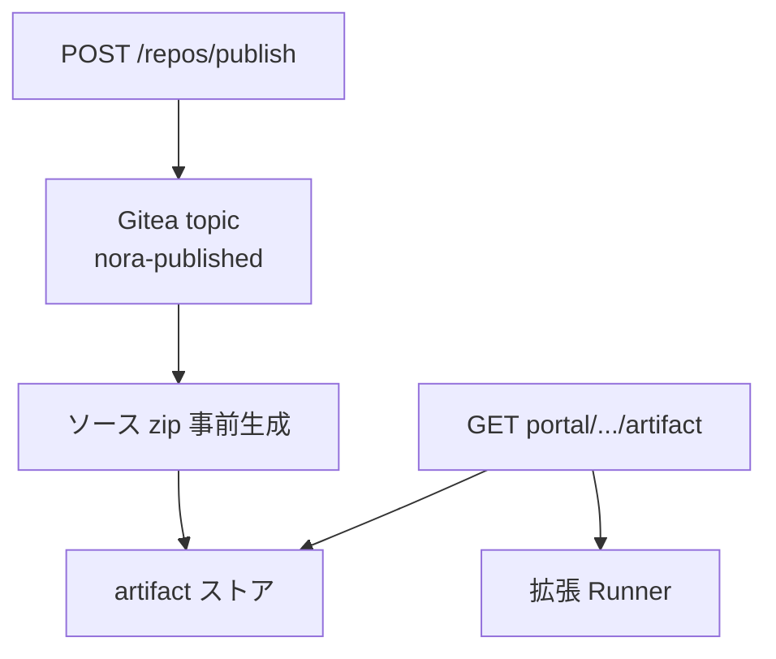
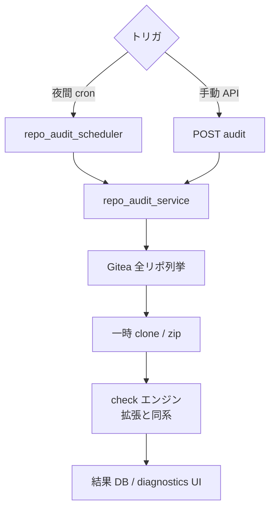
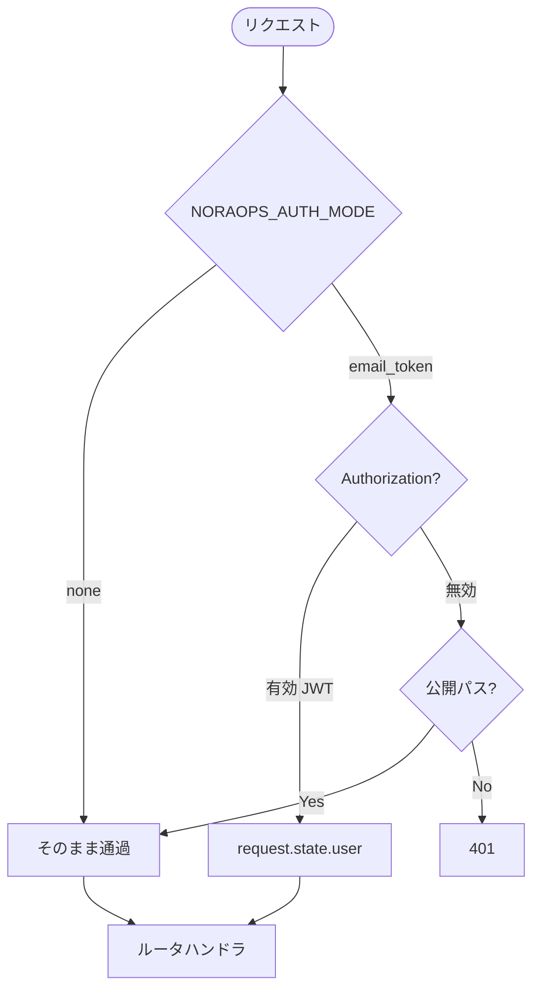
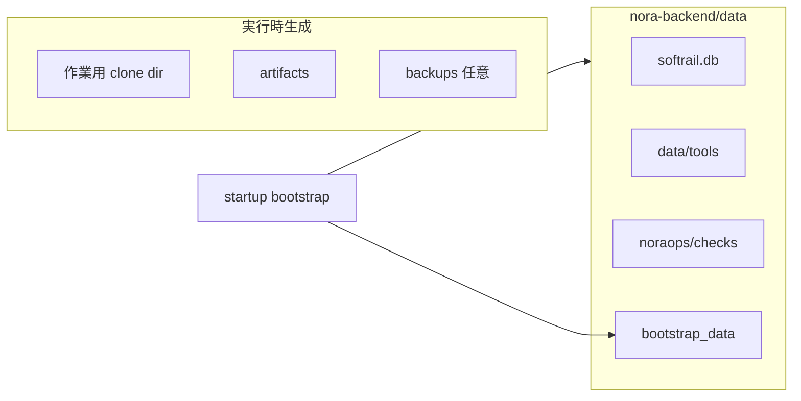

# 04 — バックエンド（nora-backend）の動作フロー

> **優しいメモ**: FastAPI アプリの心臓は `app/main.py` です。ルータが山ほどありますが、**NoraOps 本体は `app/noraops/` 配下**と覚えると迷子になりにくいです。  
> 設定の正本: `nora-backend/.env.example`

---

## 1. 起動〜リクエストの全体

```mermaid
flowchart TD
  Start([uvicorn app.main:app]) --> Boot[startup イベント]
  Boot --> Data[bootstrap_data_on_startup]
  Boot --> DB[init_engine SQLite]
  Boot --> Sched{スケジューラ}
  Sched --> Backup[backup_scheduler 任意]
  Sched --> Audit[repo_audit 夜間 任意]
  Req([HTTP リクエスト]) --> MW1[RootPathMiddleware]
  MW1 --> MW2[AuthIdentityMiddleware]
  MW2 --> Router{ルータ振り分け}
  Router --> NoraOps[/api/v1/noraops/*]
  Router --> Admin[/admin/*]
  Router --> Web[/dashboard /help /ops]
  Router --> Static[/static]
  MW2 --> Log[access_log → ApiAccessLog]
```

**メモ**

- `NORAOPS_ROOT_PATH` があると IIS サブパス用に URL が書き換わる
- Gitea 障害時は `GiteaClientError` → 503（ダッシュボードは HTML エラー）

---

## 2. ルータの地図（ざっくり）



| プレフィックス例 | 用途 |
|------------------|------|
| `/api/v1/repos/*` | zip 保存・provision・publish |
| `/api/v1/portal/*` | Runner カタログ・artifact |
| `/api/v1/noraops/packages/*` | 許可リスト・deps_audit |
| `/api/v1/noraops/checks/*` | チェックルール配信 |
| `/admin/packages` | XLSX 許可リスト管理 UI |
| `/api/tools/*` | uv / git バイナリ manifest |

一覧の正本: [機能一覧とAPI.md](../../NoraOps/機能一覧とAPI.md)

---

## 3. 保存 API（repos/save）の内部フロー



**触るとき**

- `app/noraops/routers/repos.py`
- `app/noraops/services/repo_save.py`
- `app/noraops/services/repo_provision.py`
- `app/noraops/services/app_registry_service.py`
- `app/services/gitea_client.py`

**メモ**: `GITEA_TOKEN` はサーバーだけが持つ。拡張からは見えない。

---

## 4. 公開・artifact のフロー



**触るとき**: `repo_publish` 系サービス、`portal_api.py`

---

## 5. 許可リスト（ガードレール）のサーバー側

```mermaid
flowchart TD
  Admin[/admin/packages UI] --> Upload[XLSX アップロード]
  Upload --> Svc[package_allowlist.py]
  Svc --> DB[(allowlist テーブル)]
  Ext[拡張 uv add] --> API[GET allowlist]
  API --> DB
  Ext --> Audit[POST deps_audit]
  Audit --> DB
  PyPI{pypiserver?} --> Mirror[ミラー sync]
  Mirror --> AuditCLI[deps_audit CLI]
```

**触るとき**

- `app/services/package_allowlist.py`
- `app/noraops/routers/packages.py`
- `app/templates/admin_packages.html`

---

## 6. repo-audit（横断監査）のフロー



**メモ**: `.env` の `NORAOPS_REPO_AUDIT_*` で有効化。重いので本番のみ推奨。

**触るとき**: `app/noraops/services/repo_audit_service.py`

---

## 7. 認証ミドルウェアの流れ



**触るとき**: `app/middleware/auth_identity.py`, `app/noraops/routers/auth.py`

---

## 8. データ・ファイルの置き場



**メモ**: DB ファイル名 `softrail.db` は歴史的互換のまま。env で変更可能な場合あり。

---

## 9. バックエンドを直すときのクイックガイド

| やりたいこと | まず見る場所 |
|--------------|--------------|
| 新 API 追加 | `app/noraops/routers/` + `main.py` に include |
| Gitea 操作 | `app/services/gitea_client.py` |
| 保存の不具合 | `repo_save.py` + サーバーログ |
| 管理画面 | `app/routers/admin.py` + `app/templates/` |
| 設定追加 | `app/core/config.py` + `.env.example` |
| テスト | `nora-backend/tests/` |

```powershell
cd nora-backend
pytest tests/
```

---

## 10. 起動コマンド（開発）

```powershell
cd nora-backend
.\.venv\Scripts\Activate.ps1
uvicorn app.main:app --reload --host 127.0.0.1 --port 8000
```

**メモ**: `--reload` は開発のみ。本番は IIS / サービス化（[NoraOpsの導入.md](../../NoraOps/NoraOpsの導入.md)）。
