# 05 — 機能と編集先マップ

> **優しいメモ**: 「この機能どこ？」と迷ったら **この表**を見てください。生成 AI に渡すときも、タスク行を 1 つコピーすると精度が上がります。  
> 機能 ID の詳細: [現状とアーキテクチャ.md](../../NoraOps/現状とアーキテクチャ.md) §3

---

## 1. 機能 → 編集先（一覧）

```mermaid
flowchart TB
  subgraph guard [ガードレール 主]
    Fcheck[F-checks]
    Fpy[F-python 許可リスト]
    Faudit[F-repo-audit]
  end
  subgraph creator [Creator 副]
    Fsave[F-save]
    Fprov[F-provision]
    Fpub[F-publish]
  end
  subgraph runner [Runner 副]
    Fcat[F-runner-catalog]
    Frun[F-runner-run]
    Fedit[F-runner-edit]
    Fzip[F-runner-zip]
    Fsc[F-runner-sc]
  end
  subgraph prompt [Prompt]
    Fpr[F-prompt-catalog]
  end
  Fcheck --> ExtCH[vscode checkRunner]
  Fcheck --> SrvCH[nora-backend checks]
  Fpy --> ExtPA[packageAllowlist.js]
  Fpy --> SrvPA[package_allowlist.py]
  Faudit --> SrvRA[repo_audit_service]
  Fsave --> ExtSave[savePipeline / serverSave]
  Fsave --> SrvSave[repo_save.py]
  Fprov --> ExtRepo[repoSetup]
  Fprov --> SrvProv[repo_provision.py]
  Fpub --> SrvPub[publish サービス]
  Fcat --> ExtCat[catalogClient]
  Fcat --> SrvPortal[portal_api.py]
  Frun --> ExtRun[artifactRunner]
  Frun --> SrvArt[artifact 生成]
  Fzip --> ExtZip[runnerZipImport / localRunnerRegistry]
  Fsc --> ExtSC[runnerDesktopShortcut / runner-launch.js]
  Fpr --> ExtPr[promptPanel / builtinPromptCatalog]
  Fpr --> SrvPr[bootstrap builtin-catalog.json]
```



---

## 2. 表形式マップ

### ガードレール（主機能）

| 機能 | 拡張 | バックエンド | データ / 設定 |
|------|------|--------------|---------------|
| 保存前チェック | `checkRunner.js`, `rulesClient.js` | `routers/checks.py` | `data/noraops/checks/`, `repo-policy.rules.json` |
| パッケージ許可 warn | `packageAllowlist.js`, `pythonEnv.js` | `package_allowlist.py`, `routers/packages.py` | `/admin/packages`, XLSX |
| 依存 audit 記録 | `packageAllowlist.js` | `deps_audit` エンドポイント | DB |
| 全リポ監査 | （結果は diagnostics 参照） | `repo_audit_service.py` | `NORAOPS_REPO_AUDIT_*` |

### Creator

| 機能 | 拡張 | バックエンド |
|------|------|--------------|
| 保存 zip → Gitea | `savePipeline.js`, `workspaceZip.js`, `serverSave.js` | `repo_save.py` |
| 新規リポ | `repoSetup.js`, `repoMeta.js` | `repo_provision.py`, `app_registry_service.py` |
| 公開 | `saveFlow.js` | publish ルータ / サービス |
| ホーム UI | `homePanel.js`, `noraops-home.html`, `noraOpsShell.js` | — |
| プロンプト帳 | `promptPanel.js`, `builtinPromptCatalog.js`, `noraops-prompt.html` | `GET /prompts/builtin-catalog` |
| xLLM（外部 AI） | `xllmExport.js`, `xllmCompress.js`, `xllmResponseParse.js`, `xllmApply.js` | — |
| appId | `appIdentity.js` | `AppRegistryEntry` |

### Prompt

| 機能 | 拡張 | バックエンド |
|------|------|--------------|
| 組み込みカタログ | `builtinPromptCatalog.js`, `promptResolve.js` | `bootstrap_data/.../builtin-catalog.json` |
| UI | `promptPanel.js`, `noraops-prompt.html` | — |

### Runner

| 機能 | 拡張 | バックエンド |
|------|------|--------------|
| カタログ | `catalogClient.js`, `runnerPanel.js` | `portal_api.py` |
| 起動 | `artifactRunner.js`, `artifactDownload.js` | artifact 配信 |
| **ZIP 取込** | `runnerZipImport.js`, `localRunnerRegistry.js` | — |
| **デスクトップ SC** | `runnerDesktopShortcut.js`, `scripts/runner-launch.js`, `vscode-shim.js` | — |
| .env 同期 | `runnerAppEnv.js` | — |
| サムネ | `runnerThumbnails.js` | `thumbnail` API |
| 編集へ | `openAppForEdit.js` | artifact + ワークスペース展開 |

### 横断・運用

| 機能 | 主な場所 |
|------|----------|
| 拡張バージョン配布 | `clientUpdate.js` ↔ `routers/client.py`, `client-latest.json` |
| uv / git 配布 | `toolInstaller.js` ↔ `routers/tools.py`, `data/tools/` · **同梱** `resources/tools/windows-x64/uv.exe` |
| 認証 | 拡張 `noraopsApi.js` ↔ `auth.py`, `auth_identity.py` |
| 管理 UI | — ↔ `routers/admin.py`, `templates/admin_*.html` |
| MCP 診断 | — ↔ `routers/mcp.py` |
| ヘルプ CMS | — ↔ `routers/help_web.py`, `NoraOps/*.md` |

---

## 3. 触ったら同期が必要なペア

> **重要メモ**: ここを忘れると「ローカルでは動くのに本番だけおかしい」が起きがちです。

| 変更したもの | 同期先 / 確認先 |
|--------------|-----------------|
| `pyprojectResolve.js` | `nora-backend/.../pyproject_resolve.py` |
| `repo-policy.rules.json` | bootstrap_data + data + extension resources |
| checkRunner ルール | `data/noraops/checks/` |
| 拡張 `version` | `package.json`, `client-latest.json`, 実装記録 |
| 拡張本体（本番配備） | `scripts/sync-vendor-extension.ps1` → `vendor/` |
| VSIX（uv 同梱） | `scripts/stage-bundled-uv.ps1` → `npm run package` |

正本: [MAINTENANCE.md](../MAINTENANCE.md)

---

## 4. ディレクトリ早見（リポジトリルート）

```
NoraOps/                    ← 仕様 MD（製品像・API 一覧）
docs/                       ← 入口・フロー図（ここ）
vscode-extension/src/noraops/  ← 拡張の実装本体
nora-backend/app/noraops/      ← NoraOps API 本体
nora-backend/app/services/     ← Gitea・許可リスト等
nora-backend/app/templates/    ← 管理・ポータル HTML
```

---

## 5. 生成 AI 向けプロンプト例

コピペ用（必要な行だけ使う）:

```
【タスク】保存時に manifest.appId 検証エラーが出る
【読む】docs/flows/02-ユーザ利用フロー.md §3, docs/flows/05-機能と編集先マップ.md
【編集候補】workspaceZip.js, appIdentity.js, repo_save.py, app_registry_service.py
```

```
【タスク】許可リスト XLSX を更新したが拡張に反映されない
【読む】docs/flows/04-バックエンド動作フロー.md §5
【編集候補】package_allowlist.py, packageAllowlist.js（キャッシュ TTL）
```

---

## 6. まだフロー図が薄いトピック

| トピック | 正本 |
|----------|------|
| モード・タブ全体 | **[07-モードと機能マップ](./07-モードと機能マップ.md)** |
| PyPI ミラー閉ループ | pypiserver 連携設定書 · [06 §4.3](./06-データのつながりと保管.md) |
| ワークスペース AppData | [06 §5](./06-データのつながりと保管.md) |
| AI コンシェルジュ | `routers/concierge.py`, `routers/ai.py` |
