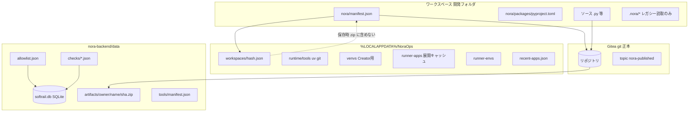
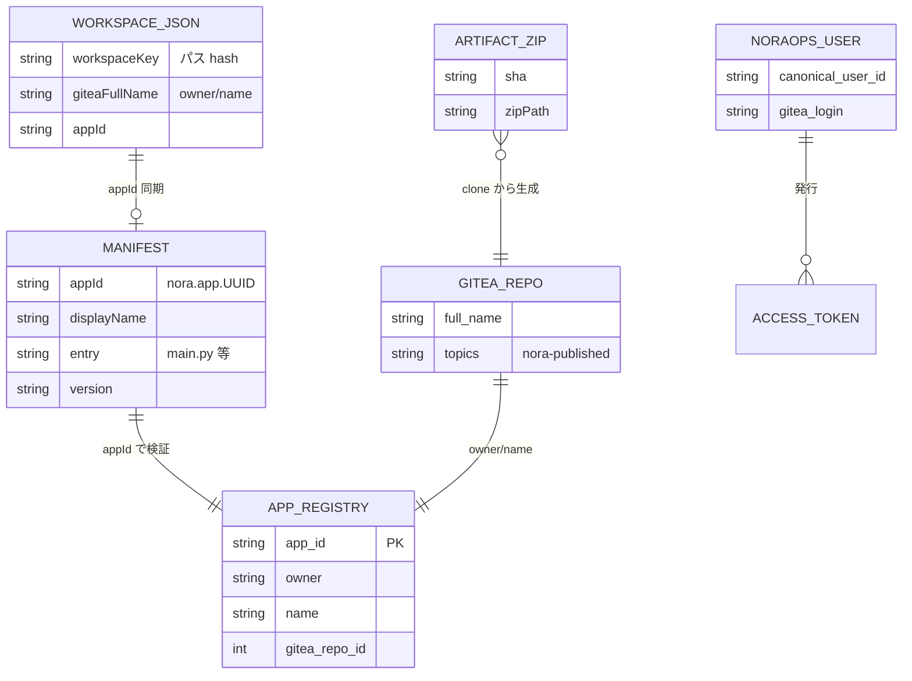
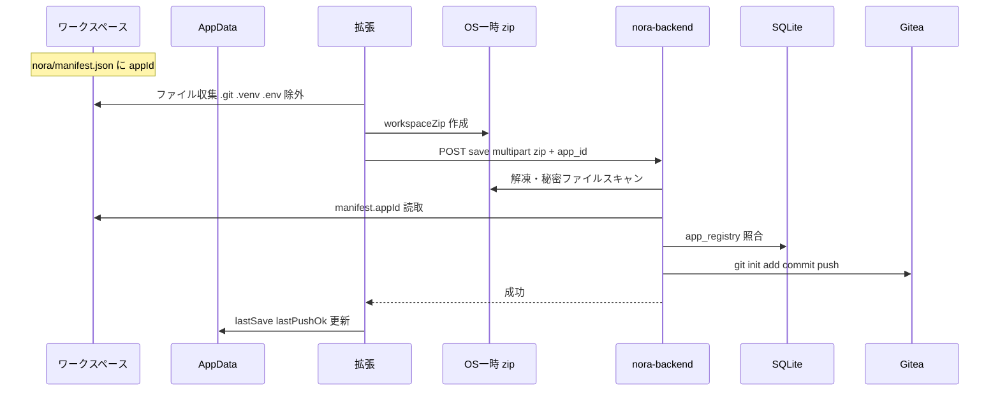
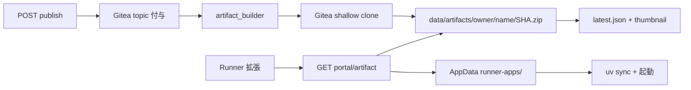
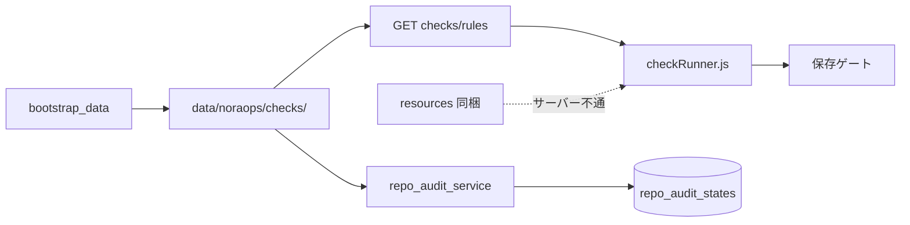
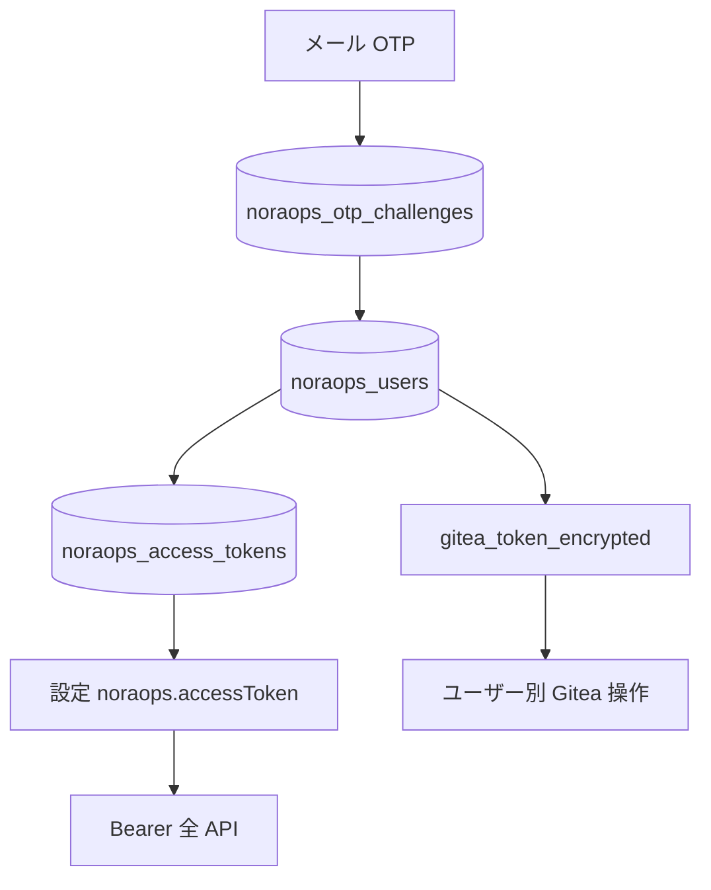
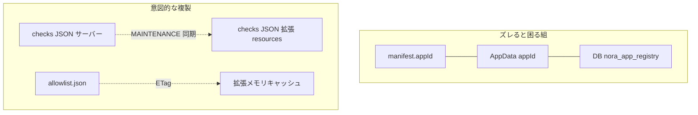

# 06 — データのつながりと保管

> **優しいメモ**: フロー図 01〜04 は「処理の順番」、この資料は **「データがどこに生まれて、どこに残り、誰が読むか」** 用です。  
> 「この JSON、消していい？」「正本はどっち？」と迷ったら、まずここを見てください。

---

## 1. 保管場所の地図（3 層）



| 層 | ざっくり役割 | 消すとどうなる？ |
|----|--------------|------------------|
| **ワークスペース** | 今編集中のソース | 未保存なら消える（git 正本は Gitea） |
| **AppData** | PC ごとの UI 状態・キャッシュ | 再生成できるが、紐づけ情報の再入力が必要な場合あり |
| **サーバー data/** | 組織共通のルール・許可リスト・artifact | **本番では要バックアップ** |
| **Gitea** | ソースの git 正本 | **最重要** — ここが真のソース保管 |

---

## 2. 「正本」はどこ？（迷ったときの表）

| データ | **正本（信頼する場所）** | コピー・キャッシュ | メモ |
|--------|--------------------------|-------------------|------|
| **アプリのソースコード** | Gitea リポ | ローカル WS、artifact zip | 保存で Gitea に上書き同期 |
| **appId** | `nora/manifest.json`（リポ内） | AppData `workspaces/*.json`、DB `nora_app_registry` | 3 つは **一致必須**（保存時検証） |
| **保存先リポ** | DB `nora_app_registry` + session の `giteaFullName` | AppData ワークスペース JSON | 初回 provision で登録 |
| **公開一覧** | Gitea の **topic** `nora-published` | なし（都度 API 取得） | topic 名は `.env` で変更可 |
| **Runner 配布物** | `data/noraops/artifacts/` | クライアント `runner-apps/` | SHA 単位でキャッシュ |
| **パッケージ許可リスト** | `data/noraops/packages/allowlist.json` | 拡張メモリキャッシュ（ETag） | XLSX は管理画面から投入 |
| **チェックルール** | `data/noraops/checks/*.json` | 拡張同梱 JSON（オフライン fallback） | 3 箇所同期に注意 |
| **uv / git バイナリ** | `data/tools/` | AppData `runtime/tools/` | manifest.json が索引 |
| **ユーザー認証** | DB `noraops_users` 等 | VS Code 設定の accessToken | トークンは DB にハッシュのみ |
| **監査結果** | DB `repo_audit_states` | `result_json` 内に詳細 | Gitea 横断のスナップショット |

---

## 3. 中心 ID のつながり（ER 図）



**優しいメモ — appId の流れ**

1. **新規作成**: 拡張 `appIdentity.js` が UUID を発行 → `nora/manifest.json` に書く  
2. **初回保存**: zip 内 manifest → サーバーが `nora_app_registry` に登録  
3. **以降**: AppData の session も同じ appId を保持（UI 用）  
4. **ズレると**: 保存 API が **400 系で拒否**（別アプリと別リポのすり替え防止）

---

## 4. データの一生 — シナリオ別

### 4.1 Creator 保存（ソースが Gitea に行くまで）



| 段階 | データの形 | 保管先 |
|------|------------|--------|
| 編集中 | フォルダツリー | ワークスペース |
| zip 化 | 一時 `.zip` | `%TEMP%/noraops-ws-*`（保存後削除） |
| 正本化 | git ツリー | **Gitea** |
| 紐づけ | appId ↔ owner/name | **SQLite** `nora_app_registry` |
| UI 用 | 最終保存時刻など | **AppData** `workspaces/{key}.json` |

**zip に入らないもの（意図的）**: `.git`, `.venv`, `.env`, `.nora`, `node_modules` など — `workspaceZip.js` の `EXCLUDE_*` を参照。

---

### 4.2 公開 → Runner が使う artifact



| 項目 | 場所 | 備考 |
|------|------|------|
| 公開フラグ | Gitea **topic** | カタログは topic でフィルタ |
| artifact 本体 | `data/noraops/artifacts/{owner}/{name}/{sha}.zip` | 同 SHA なら再ビルドしない |
| メタ | 同フォルダの `latest.json` | branch, builtAt |
| サムネ | `thumbnail.png` | リポの `nora/assets/thumbnail.png` からコピー |
| クライアント側 | `runner-apps/{owner}__{name}/` | 再ダウンロードで更新 |

---

### 4.3 パッケージ許可リスト

```mermaid
flowchart TD
  XLSX[管理者 XLSX] --> Admin[/admin/packages アップロード]
  Admin --> JSON[data/noraops/packages/allowlist.json]
  JSON --> API[GET packages/allowlist]
  API --> ExtMem[拡張メモリ Map + ETag]
  ExtMem --> Warn[uv add 時 warn]
  Warn --> Tel[POST deps_audit]
  Tel --> DB[(telemetry_events)]
  DB --> Dash[管理画面 deps ダッシュボード]
```

**メモ**

- **正本は JSON ファイル**（DB テーブルではない）
- 拡張は **304 Not Modified** で再取得を省略
- `deps_audit` は **違反の記録**（許可リストそのものではない）

---

### 4.4 チェックルール（セキュリティ・ポリシー）



| ファイル例 | 内容 |
|------------|------|
| `security.rules.json` | 危険パターン（IP 直書き等） |
| `repo-policy.rules.json` | リポ構成ポリシー |
| `manifest.softrail.json` 等 | 契約メタ（Gitea 互換名） |

---

### 4.5 認証データ（本番 email_token）



**メモ**: 利用者 PC に **Gitea PAT は載せない**（サーバー `.env` の `GITEA_TOKEN` またはユーザー暗号化トークン）。

---

## 5. AppData の中身（PC ローカル）

```
%LOCALAPPDATA%\NoraOps\
  workspaces\
    {sha256(workspacePath)}.json   ← セッション正本（.nora 後継）
  runtime\
    tools\                           ← uv / git（サーバー manifest から DL）
  venvs\                             ← Creator の uv venv
  runner-apps\
    {owner}__{name}\                 ← artifact 展開先
  runner-envs\
    {owner}__{name}\                 ← Runner 専用 venv
  recent-apps.json                   ← 最近開いたアプリ UI
```

| ファイル | 誰が書く | 主なキー |
|----------|----------|----------|
| `workspaces/*.json` | 拡張 `workspaceStore.js` | `appId`, `giteaFullName`, `pythonEnv`, `lastSave` |
| `recent-apps.json` | `pathsMeta.js` | 最近のアクセス履歴 |

スキーマ詳細: [workspaces-schema.md](../../NoraOps/workspaces-schema.md)

**レガシー `.nora/`（ワークスペース内）**

| ファイル | 今の扱い |
|----------|----------|
| `session.json` | **読むだけ** → AppData に取り込み |
| `python-env.json` | 同上 → `pythonEnv` ブロックへ |
| `security-warn-state.json` | 同上 |

---

## 6. ワークスペース内の Nora ファイル

| パス | 役割 | Gitea に入る？ |
|------|------|----------------|
| `nora/manifest.json` | appId・起動 entry・版 | **はい**（必須） |
| `nora/packages/pyproject.toml` | Python 依存定義 | はい |
| `nora/assets/thumbnail.png` | Runner サムネ | はい（あれば） |
| `nora/dev/static|media/uploads/` | 実行時アップロード | **いいえ**（zip 除外） |
| `.venv/` | ローカル venv | **いいえ**（各自 uv で再現） |

manifest テンプレ: `vscode-extension/resources/templates/nora/manifest.json`

---

## 7. SQLite（softrail.db）テーブル早見

| テーブル | 何のデータ？ |
|----------|--------------|
| `nora_app_registry` | **appId ↔ Gitea owner/name**（保存検証の要） |
| `noraops_users` | NoraOps ユーザー ↔ Gitea login |
| `noraops_access_tokens` | 拡張用長期トークン（ハッシュ） |
| `noraops_sessions` | Web OTP セッション |
| `telemetry_events` | `deps_audit` 等のイベント |
| `repo_audit_states` | リポ横断監査の最新結果 |
| `runner_activity_logs` | Runner 起動ログ |
| `api_access_logs` | HTTP アクセスログ |
| `app_config` | 管理画面から変えるランタイム設定 |

パス: `./data/softrail.db`（`SOFTRAIL_SQLITE_PATH`）

---

## 8. 同じデータが複数あるとき（要注意）



| 疑問 | 答え |
|------|------|
| session と manifest の appId が違う | `appBinding.js` / 保存前チェックで揃える。直さないと save 失敗 |
| 許可リストを更新したのに拡張が古い | ETag / 拡張再起動。サーバー `allowlist.json` が正 |
| ルールを直したのに監査だけ古い | `repo_audit_states.last_audit_at` — 再監査が必要 |
| ローカルと Gitea のソースが違う | **Gitea が正**（次の保存で上書き） |

同期ルール: [MAINTENANCE.md](../MAINTENANCE.md)

---

## 9. 編集するときの「データ」早見

| 触りたいデータ | 編集・参照ファイル |
|----------------|-------------------|
| ワークスペース状態 | `workspaceStore.js` |
| manifest / appId | `scaffold.js`, `appBinding.js`, `appIdentity.js` |
| zip 内容 | `workspaceZip.js` |
| 保存検証 | `repo_save.py`, `app_registry_service.py` |
| artifact | `artifact_builder.py`, `portal_api.py` |
| 許可リスト | `package_allowlist.py`, `admin_packages.html` |
| 監査結果 | `repo_audit_service.py`, `models.RepoAuditState` |

機能との対応: [05-機能と編集先マップ](./05-機能と編集先マップ.md)

---

## 10. 生成 AI 向けワンライナー

> 「NoraOps のデータ正本は **ソース=Gitea、appId=manifest+registry、ルール=server data/checks、許可=allowlist.json、Runner=artifacts、PC 状態=AppData workspaces**」

この一文 + 該当セクション（§4.x）を渡すと、保管場所の推測ミスが減ります。
