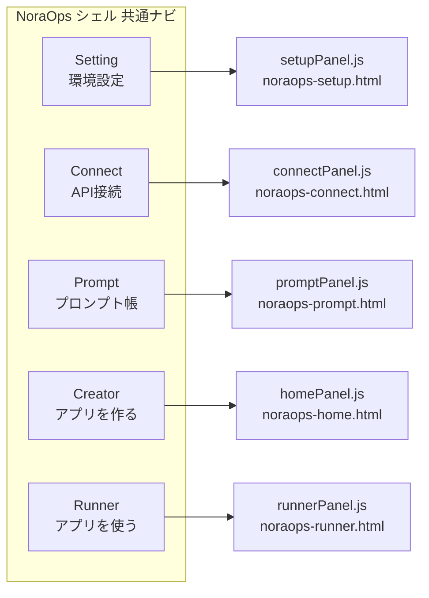
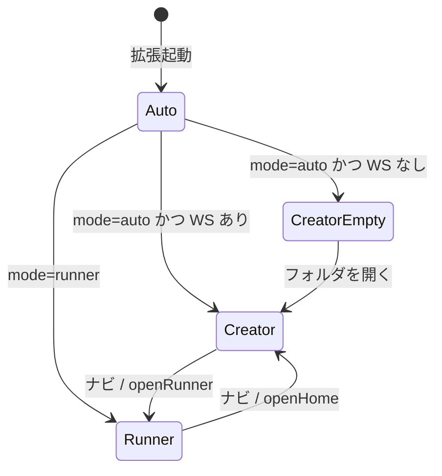
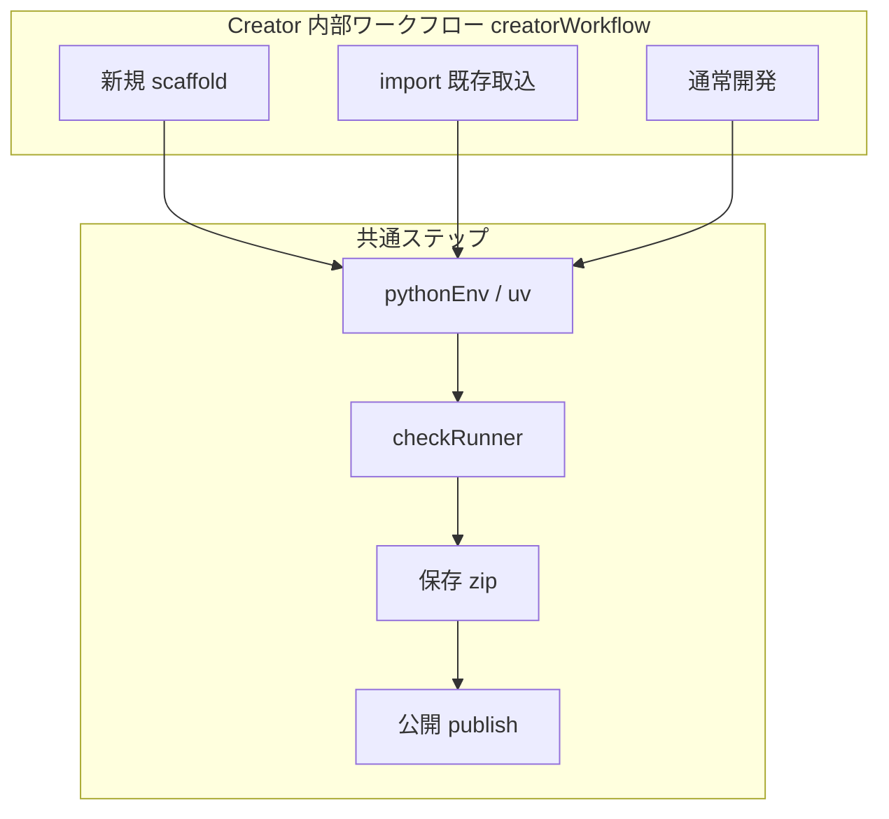
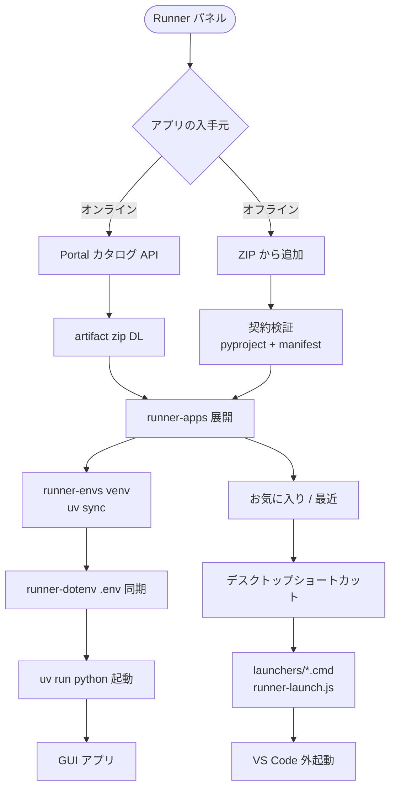
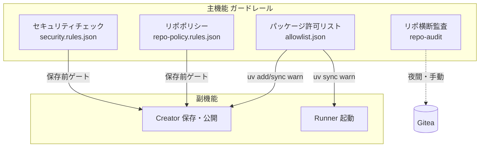
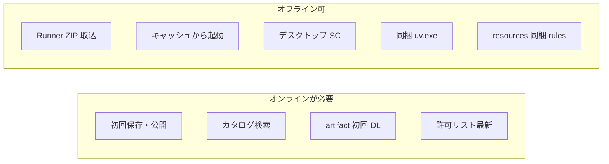

# 07 — モードと機能マップ

> **誰向け**: 引き継ぎ先の開発者・運用担当・生成 AI。  
> **目的**: 「NoraOps には何があるのか」「どのモードで何ができるのか」を **1 本で把握**する。  
> **現行バージョン**: 拡張 **v0.25.0** · バックエンド **v0.25.0**（2026-07 時点。矛盾時はコードが勝ち）

---

## 1. 製品の三層（責務の分離）

```mermaid
flowchart TB
  subgraph client ["vscode-extension（クライアント）"]
    direction TB
    UI[Webview UI<br/>5 タブシェル]
    Guard[ガードレール<br/>checkRunner・許可リスト]
    Creator[Creator<br/>開発・保存・公開]
    Runner[Runner<br/>起動・ZIP・ショートカット]
    Tools[uv / git 同梱・DL]
  end
  subgraph server ["nora-backend（サーバー）"]
    API[FastAPI /api/v1]
    Admin[/admin 管理画面]
    Data[data/ SQLite・artifacts・rules]
  end
  subgraph external [外部]
    Gitea[(Gitea git 正本)]
    PyPI[(PyPI / 社内ミラー)]
  end
  UI --> Guard
  UI --> Creator
  UI --> Runner
  Creator --> Guard
  Creator --> API
  Runner --> API
  Runner --> Tools
  Creator --> Tools
  API --> Gitea
  API --> Data
  Tools --> PyPI
  Guard --> API
```

| 層 | 正本ソース | 配備物 |
|----|------------|--------|
| 拡張 | `vscode-extension/` | `.vsix`（任意で `uv.exe` 同梱） |
| サーバー | `nora-backend/` | Python パッケージ + `data/` |
| 仕様 MD | `NoraOps/` + **`docs/`（入口）** | リポジトリ内 |

**設計の核**: 拡張は **git push しない**。保存は zip → サーバー → Gitea。Runner は **artifact zip** のみ（clone しない）。

---

## 2. UI シェル — 5 タブと役割

全 Webview（`noraops-*.html`）で共通の下部ナビ。`data-nav` でパネル切替。



| タブ | 主な利用者 | できること |
|------|------------|------------|
| **Setting** | 全員 | サーバー URL・プロキシ・アカウント（OTP）・ツール（uv）状態・セキュリティガード概要 |
| **Connect** | 開発者 | API 接続テスト・診断コマンドのコピー |
| **Prompt** | 開発者 | 組み込みプロンプト帳（`builtin-catalog.json`）の閲覧・コピー |
| **Creator** | 開発者 | 雛形・venv・保存・公開・xLLM 連携・Copilot BYOK 補助 |
| **Runner** | 利用者 | カタログ起動・お気に入り・ZIP 取込・デスクトップショートカット・ストレージ整理 |

**入口コード**: `activate.js` → `openPrimaryUi()` → `getEffectiveMode()` で初回表示が Creator / Runner のどちらか。

---

## 3. 起動モード（`noraops.mode`）



| 設定値 | 起動時に開くパネル | 典型ユーザー |
|--------|-------------------|--------------|
| `auto`（既定） | ワークスペースあり → **Creator** / なし → Creator（空） | 開発者 |
| `runner` | **Runner** | 利用者・配布 PC |
| `creator` | **Creator**（強制） | 開発専用 |

設定: VS Code `noraops.mode` · 実装: `mode.js`, `getEffectiveMode()`

---

## 4. Creator ワークフロー（開発モードの中身）



| フェーズ | ユーザー操作 | 内部の主モジュール |
|----------|--------------|-------------------|
| 雛形 | 「アプリの雛形を用意」 | `scaffold.js`, `prepareWorkspace` |
| 環境 | 「Python 環境を用意」 | `pythonEnv.js`, `toolInstaller.js` |
| 開発 | F5 / ターミナル | `launchConfig.js`, `appEntry.js` |
| 保存 | 保存ボタン | `savePipeline.js` → `checkRunner` → `workspaceZip` → `serverSave` |
| 公開 | 公開（任意） | `saveFlow.js` → `POST /repos/publish` |
| 外部 AI | xLLM エクスポート | `xllmExport.js`, `xllmCompress.js`, `xllmApply.js` |

**zip に入らないもの**: `.env`, `.venv`, `.git` 等 — `workspaceZip.js` の `EXCLUDE_*`

---

## 5. Runner 機能マップ（利用モードの中身）



| 機能 | 説明 | 主なファイル |
|------|------|--------------|
| カタログ検索 | 公開リポジトリを名前・説明で検索 | `catalogClient.js`, `portal_api.py` |
| お気に入り / 最近 | `runner-app-prefs.json` | `runnerAppPrefs.js` |
| artifact 起動 | サーバーから zip → キャッシュ → uv | `artifactRunner.js`, `artifactDownload.js` |
| **ZIP 取込** | Gitea 不要・オフライン可 | `runnerZipImport.js`, `localRunnerRegistry.js` |
| **デスクトップ SC** | `.lnk` + サムネアイコン | `runnerDesktopShortcut.js`, `scripts/runner-launch.js` |
| ストレージ整理 | runner-apps / venv 削除 UI | `storagePanel.js`, `localStorageScan.js` |
| 更新検知 | 公開 SHA とローカル比較 | `runnerUpdateCheck.js` |

**ショートカット起動の流れ**: デスクトップ `.lnk` → `.cmd` → `runner-launch.js` → 拡張内 `runnerLaunchCli.js` → `artifactRunner`（VS Code 外は `vscode-shim.js` 経由）

---

## 6. ガードレール（主機能）と副機能の関係



| チェック | タイミング | 失敗時 |
|----------|------------|--------|
| checkRunner | **保存前**（必須） | 保存不可 |
| 許可リスト | venv 構築・パッケージ追加 | warn（続行可）・サーバー記録 |
| repo-audit | 管理者トリガー | 利用者には非同期 |

---

## 7. 機能 ID → 実装早見（引き継ぎ用）

| ID | 機能 | 拡張 | サーバー |
|----|------|------|----------|
| F-checks | 保存前チェック | `checkRunner.js` | `routers/checks.py` |
| F-python | 許可リスト | `packageAllowlist.js` | `package_allowlist.py` |
| F-save | zip 保存 | `savePipeline.js`, `serverSave.js` | `repo_save.py` |
| F-publish | 公開 | `saveFlow.js` | publish ルータ |
| F-runner-catalog | カタログ | `catalogClient.js` | `portal_api.py` |
| F-runner-run | 起動 | `artifactRunner.js` | artifact 配信 |
| F-runner-zip | ZIP 取込 | `runnerZipImport.js` | —（クライアントのみ） |
| F-runner-sc | ショートカット | `runnerDesktopShortcut.js` | — |
| F-prompt | プロンプト帳 | `promptPanel.js`, `builtinPromptCatalog.js` | `builtin-catalog.json` |
| F-tools | uv/git | `toolInstaller.js` | `routers/tools.py` |
| F-auth | 認証 | `accessTokenAuth.js` | `auth.py` |
| F-client | VSIX 更新 | `clientUpdate.js` | `client-latest.json` |

詳細なファイルパス: [05-機能と編集先マップ](./05-機能と編集先マップ.md)

---

## 8. オフライン・閉域で動く範囲



| 条件 | 内容 |
|------|------|
| VSIX に `uv.exe` 同梱 | `stage-bundled-uv.ps1` → `npm run package` |
| 設定 | `noraops.tools.useBundledUv`（既定 ON） |
| Runner ZIP | `pyproject.toml` + `nora/manifest.json` 契約どおり |

---

## 9. 引き継ぎ時に最初に触るファイル（Top 15）

| 順 | ファイル | 理由 |
|----|----------|------|
| 1 | `vscode-extension/src/noraops/activate.js` | 拡張の全入口 |
| 2 | `vscode-extension/src/noraops/savePipeline.js` | 保存の心臓 |
| 3 | `vscode-extension/src/noraops/checkRunner.js` | ガードレール |
| 4 | `vscode-extension/src/noraops/runner/artifactRunner.js` | Runner 起動 |
| 5 | `nora-backend/app/noraops/routers/` | API 一覧 |
| 6 | `nora-backend/app/services/repo_save.py` | 保存サーバー側 |
| 7 | `nora-backend/.env.example` | サーバー設定の正本 |
| 8 | `docs/flows/06-データのつながりと保管.md` | データの正本 |
| 9 | `docs/MAINTENANCE.md` | リリース同期ルール |
| 10 | `NoraOps/機能一覧とAPI.md` | API 網羅 |
| 11 | `vscode-extension/package.json` | バージョン・設定キー |
| 12 | `localRunnerRegistry.js` | ローカル ZIP レジストリ |
| 13 | `runnerDesktopShortcut.js` | デスクトップ SC |
| 14 | `toolInstaller.js` | uv 同梱・DL |
| 15 | `workspaceStore.js` | AppData ワークスペース状態 |

---

## 10. 関連ドキュメント

| 資料 | 内容 |
|------|------|
| [02-ユーザ利用フロー](./02-ユーザ利用フロー.md) | 利用者視点のシーケンス |
| [06-データのつながりと保管](./06-データのつながりと保管.md) | 正本・キャッシュ |
| [05-機能と編集先マップ](./05-機能と編集先マップ.md) | 編集先ファイル |
| [MAINTENANCE.md](../MAINTENANCE.md) | リリース・同期 |
| [製品像とロードマップ](../../NoraOps/製品像とロードマップ.md) | 製品思想 |
