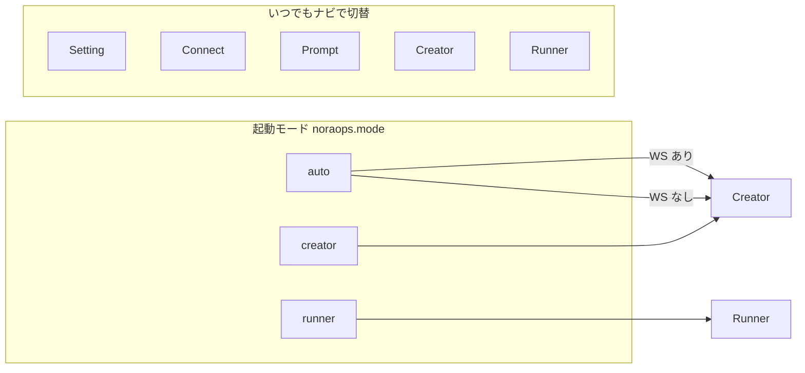

# NoraOps フロー図（開発・運用の地図）

> **誰向け**: 人間の開発者・運用担当・生成 AI。  
> **最初の一歩**: モードと機能の全体 → **[07-モードと機能マップ](./07-モードと機能マップ.md)**  
> **データの正本**: **[06-データのつながりと保管](./06-データのつながりと保管.md)**

**現行**: 拡張 v0.25.0 · バックエンド v0.25.0 · 最終更新 2026-07

---

## このフォルダの読み方

| 順 | 資料 | いつ読む？ |
|----|------|------------|
| **★1** | **[07-モードと機能マップ](./07-モードと機能マップ.md)** | **何がある製品か・モード・タブ・機能のつながり** |
| **★2** | **[06-データのつながりと保管](./06-データのつながりと保管.md)** | どこに何が残るか・正本はどこか |
| 1 | [01-セットアップフロー](./01-セットアップフロー.md) | 初回導入・本番・開発環境・VSIX ビルド |
| 2 | [02-ユーザ利用フロー](./02-ユーザ利用フロー.md) | 利用者が何をしているか |
| 3 | [03-拡張内部フロー](./03-拡張内部フロー.md) | `vscode-extension/` を直すとき |
| 4 | [04-バックエンド動作フロー](./04-バックエンド動作フロー.md) | `nora-backend/` を直すとき |
| 5 | [05-機能と編集先マップ](./05-機能と編集先マップ.md) | この機能、どのファイル？ |

**管理者向け（ブラウザ）**: `/admin/topology` — 連携マップ（.env と機能の対応）

---

## 全体の一枚絵

```mermaid
flowchart TB
  subgraph people [人]
    Admin[運用・管理者]
    Dev[開発者]
    User[利用者]
  end
  subgraph shell [拡張 UI 5 タブ]
    Setup[Setting]
    Connect[Connect]
    Prompt[Prompt]
    Creator[Creator]
    Runner[Runner]
  end
  subgraph core [コア処理]
    Guard[ガードレール]
    Save[保存 zip]
    Art[artifact / ZIP]
  end
  subgraph server [nora-backend]
    API[FastAPI]
    AdminUI[/admin]
  end
  subgraph external [外部]
    Gitea[(Gitea)]
    PyPI[(PyPI)]
  end
  Admin --> AdminUI
  Dev --> shell
  User --> Runner
  Dev --> Creator
  Creator --> Guard
  Creator --> Save
  Runner --> Art
  Save --> API
  Art --> API
  Guard --> API
  API --> Gitea
  Creator --> PyPI
  Runner --> PyPI
```

**メモ**: 拡張は **git push しない**。保存は zip → サーバー → Gitea。詳細は [02](./02-ユーザ利用フロー.md) · [07](./07-モードと機能マップ.md)。

---

## モードとタブ（要約）



詳細な機能一覧: **[07 §2–§5](./07-モードと機能マップ.md)**

---

## 生成 AI に渡すときのコツ

1. **タスクの種類**に合わせて **1 本**をコンテキストに入れる（07 + 05 など）
2. コード変更後は [05](./05-機能と編集先マップ.md) で隣接同期を確認
3. 矛盾したら **コードが勝ち**

---

## 関連ドキュメント

| 資料 | 用途 |
|------|------|
| [docs/README.md](../README.md) | ドキュメント総入口 |
| [MAINTENANCE.md](../MAINTENANCE.md) | リリース・uv 同梱ビルド |
| [製品像とロードマップ](../../NoraOps/製品像とロードマップ.md) | 製品思想 |
