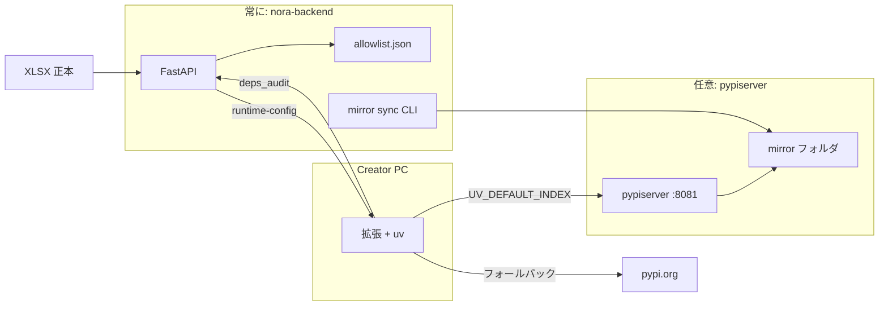

# pypiserver サービス連携 — 設定書兼仕様書

NoraOps（**nora-backend** + 拡張 + Gitea）に **社内 PyPI ミラー（pypiserver）** を足したときの仕様・導入手順・運用です。

> **位置づけ**: pypiserver は **別プロセス**（公式 `pypiserver` を NSSM で起動）。許可リスト・監査・ミラー取得は **nora-backend** が担当します。  
> 関連の短い運用メモ: [NoraOps/PyPIミラー運用.md](../../NoraOps/PyPIミラー運用.md)  
> 導入の全体像（本番チェックリスト）: [NoraOps/NoraOpsの導入.md](../../NoraOps/NoraOpsの導入.md) §7

---

## 1. pypiserver あり／なしで何が変わるか

### pypiserver **なし**（既定・そのまま使える）

| 項目 | 挙動 |
|------|------|
| 拡張の `uv sync` | **pypi.org 直**（従来どおり） |
| 許可リスト | 空でも可。XLSX を取込めば **warn + deps_audit** は動く |
| 管理画面 `/admin/packages` | 利用可（未許可の集計） |
| nora-backend | `NORAOPS_PYPI_INDEX_URL` **未設定**なら PyPI 連携は無効扱い |

**必須ではありません。** 社内ミラーがなくても NoraOps の保存・Runner・チェックは問題なく動きます。

### pypiserver **あり**（`.env` で有効化）

| できること | 説明 |
|------------|------|
| **社内第一の pip/uv** | Creator PC は社内 simple index から取得（高速・外向き削減） |
| **共有ミラーは許可済みのみ** | ミラー sync は allowlist 上のパッケージだけ `mirror/` に配置 |
| **未許可の可視化** | 拡張が warn → 同期後に `deps_audit` → 管理画面で Top 表示 |
| **フォールバック監査** | 社内に無い依存は PyPI 直で入る可能性あり → **ミラーには載せない**・audit で把握 |
| **運用の閉ループ** | XLSX 更新 → ミラー job → 次回から社内 index で配布 |



---

## 2. コンポーネントと責務

| コンポーネント | プロセス | 責務 |
|----------------|----------|------|
| **nora-backend** | uvicorn（例: `:8000`） | 許可リスト API、deps_audit、runtime-config、管理 UI、ミラー sync |
| **pypiserver** | NSSM（例: `127.0.0.1:8081`） | `mirror/` 内の wheel/sdist を **配信のみ** |
| **IIS + ARR** | IIS | `/NoraOps/api/*` → FastAPI、`/NoraOps/pypi/*` → pypiserver |
| **拡張** | VS Code | warn、uv の index 環境変数、監査 POST |

**pypiserver は許可リストを解釈しません。** 許可の適用は次の2段です。

1. **ミラーに載せるか** — `scripts/pypi-mirror-sync.py`（allowlist ベース）  
2. **開発者に知らせるか** — 拡張 + `/admin/packages`

---

## 3. 推奨ホスト構成

```
[Creator PC]  uv / 拡張
      │
      ▼ HTTPS（社内）
[IIS]  /NoraOps/api/...  ──ARR──► 127.0.0.1:8000  (nora-backend)
       /NoraOps/pypi/... ──ARR──► 127.0.0.1:8081  (pypiserver)
```

- API と PyPI は **サブパスを分ける**（混在させない）。  
- pypiserver は **ループバックのみ**で listen し、外向きは IIS 経由に限定するのが安全です。  
- FastAPI 側のサブパス全般: [NoraOps/IIS-ARR配備.md](../../NoraOps/IIS-ARR配備.md)

---

## 4. 導入手順（やさしい順）

### 前提

- Windows Server（または同等）に Python 3.11+  
- nora-backend が起動済み（`http://127.0.0.1:8000/` または IIS 経由）  
- ミラー用ディレクトリ（既定）: `nora-backend/data/noraops/packages/mirror`

---

### ステップ A — pypiserver を入れる（公式どおり）

管理者 PowerShell:

```powershell
python -m pip install --upgrade pypiserver
```

動作確認（一時起動）:

```powershell
$packages = Join-Path (Get-Location) "data\noraops\packages\mirror"
New-Item -ItemType Directory -Force -Path $packages | Out-Null
python -m pypiserver run -p 127.0.0.1:8081 -P $packages
```

別ターミナルで:

```powershell
curl http://127.0.0.1:8081/simple/
```

HTML の simple index が返れば OK。`Ctrl+C` で止めて次へ。

---

### ステップ B — NSSM で常駐化

[NSSM](https://nssm.cc/) を使い、再起動後も自動起動します。

```powershell
$python = "C:\Python311\python.exe"   # 環境に合わせる
$packages = Join-Path (Get-Location) "data\noraops\packages\mirror"

nssm install NoraOpsPypiserver $python "-m" "pypiserver" "run" "-p" "127.0.0.1:8081" "-P" $packages
nssm set NoraOpsPypiserver AppStdout "C:\NoraOps\logs\pypiserver-stdout.log"
nssm set NoraOpsPypiserver AppStderr "C:\NoraOps\logs\pypiserver-stderr.log"
nssm start NoraOpsPypiserver
```

確認:

```powershell
nssm status NoraOpsPypiserver
curl http://127.0.0.1:8081/simple/
```

> **注意**: `-P` のパスは、後述の `NORAOPS_PYPI_MIRROR_DIR` と **同じフォルダ**にしてください。

---

### ステップ C — IIS ARR で `/NoraOps/pypi/` を公開

1. IIS で **URL Rewrite** と **Application Request Routing (ARR)** を有効化  
2. 既存の NoraOps サイト（`/NoraOps` → uvicorn）とは **別ルール**で pypiserver へ転送  

**例（イメージ）**: 着信 `https://intranet/NoraOps/pypi/simple/` → `http://127.0.0.1:8081/simple/`

- ルール名例: `NoraOps PyPI → pypiserver`  
- パターン: `^NoraOps/pypi/(.*)`  
- 転送先: `http://127.0.0.1:8081/{R:1}`  

社内 LAN のみアクセス可能にする（ファイアウォール / IIS IP 制限）は **推奨**です。

確認（社内 URL）:

```powershell
curl https://intranet/NoraOps/pypi/simple/
```

---

### ステップ D — nora-backend の `.env` を有効化

`nora-backend/.env`（未作成なら `.env.example` をコピー）:

```env
# --- PyPI ミラー（pypiserver 連携）---
# ARR 経由の simple index（末尾 /simple/ 推奨）
NORAOPS_PYPI_INDEX_URL=https://intranet/NoraOps/pypi/simple/

# 1=社内に無いパッケージは PyPI も見る（拡張が UV_EXTRA_INDEX_URL を付与）
NORAOPS_PYPI_FALLBACK_ENABLED=1

# ミラー sync が wheel を置く場所（pypiserver の -P と同一）
NORAOPS_PYPI_MIRROR_DIR=./data/noraops/packages/mirror
NORAOPS_PYPI_MIRROR_ARCHIVE_DIR=./data/noraops/packages/mirror-archive
```

IIS で API もサブパス運用している場合は、既存どおり:

```env
NORAOPS_ROOT_PATH=/NoraOps
NORAOPS_PUBLIC_BASE_URL=https://intranet/NoraOps
```

**再起動**:

```powershell
# uvicorn を再起動（サービスなら再起動）
```

**無効化したいとき**: `NORAOPS_PYPI_INDEX_URL` を空にするか行をコメントアウト → 拡張は PyPI 直に戻ります。

---

### ステップ E — 拡張の接続先

VS Code 設定（ワークスペースまたはユーザー）:

| 設定 | 例 | 説明 |
|------|-----|------|
| `noraops.server.baseUrl` | `https://intranet/NoraOps` | API と同じオリジン（末尾スラッシュなし） |

拡張は起動時に `GET /api/v1/noraops/client/runtime-config` を読み、`pypiIndexUrl` が空でなければ `uv sync` 時に `UV_DEFAULT_INDEX` を設定します。

---

### ステップ F — 許可リストを入れる

1. ブラウザで `https://intranet/NoraOps/admin/packages` を開く  
2. XLSX をアップロード  

**XLSX 列（フォームで指定。以下は既定値）**

| 項目 | 既定列 | 必須 | 内容 |
|------|--------|------|------|
| ヘッダ行番号 | 9 行目 | はい | 次行からデータ（10 行目以降） |
| 分類 | A | いいえ | 分類フィルタと組み合わせ（既定: `Pythonライブラリ`） |
| パッケージ名 | B | はい | 例 `requests` |
| バージョン制約 | C | はい | `>=2.28,<3` / `2.*` / `1.*.*` / 空・`-`＝任意 |
| メンテナンス日 | D | いいえ | メタデータとして保存 |

取込時に **許可 / 要確認 / スキップ** に分類します。要確認・スキップは許可リストに入りません。

保存先: `data/noraops/packages/allowlist.json`

---

### ステップ G — ミラー sync（初回・定期）

```powershell
cd nora-backend
.\.venv\Scripts\python.exe scripts\pypi-mirror-sync.py
```

成功すると `mirror/` に wheel が増え、pypiserver から配信されます。  
状態ファイル: `data/noraops/packages/mirror-status.json`

**タスクスケジューラ（例）**

| 項目 | 値 |
|------|-----|
| トリガー | 毎日 02:00 |
| プログラム | `python` |
| 引数 | `nora-backend\scripts\pypi-mirror-sync.py` |
| 作業フォルダ | `nora-backend` |

---

### ステップ H — Creator で確認

1. ワークスペースで「Python 環境を用意」／パッケージ同期  
2. `pyproject.toml` に許可外の依存があると **モーダル warn**（続行可）  
3. 同期後、未許可があればサーバーに `deps_audit` が記録される  
4. `/admin/packages` で「未許可 Top」を確認  

---

## 5. nora-backend 設定一覧

| 環境変数 | 既定 | pypiserver ありで設定する値 |
|----------|------|-----------------------------|
| `NORAOPS_PYPI_INDEX_URL` | 空 | ARR 経由 simple index URL |
| `NORAOPS_PYPI_FALLBACK_ENABLED` | `1` | `1` 推奨（社内に無い分は PyPI・監査対象） |
| `NORAOPS_PYPI_MIRROR_DIR` | `./data/noraops/packages/mirror` | pypiserver の `-P` と同一 |
| `NORAOPS_PYPI_MIRROR_ARCHIVE_DIR` | `./data/noraops/packages/mirror-archive` | allowlist から外れたファイルの退避先 |

**動作の切り替え**

| `NORAOPS_PYPI_INDEX_URL` | 拡張の uv | ミラー sync |
|--------------------------|-----------|-------------|
| 空 | PyPI 直 | 手動実行は可能（配信は社内 URL なし） |
| 設定あり | 社内 index 第一 + 任意で PyPI | 運用で定期実行を推奨 |

---

## 6. 許可リストの運用（日常）

### 6.1 正本

- **正本**: 運用チームの XLSX  
- **サーバー上の実体**: `allowlist.json`（管理画面から取込）  
- **開発者への反映**: 拡張が ETag 付きで GET（変更時のみ再取得）

### 6.2 典型的なフロー

```
開発者が新ライブラリを pyproject に追加
    → 環境作成時に warn（ブロックしない）
    → uv sync（社内 or PyPI フォールバック）
    → deps_audit がサーバーへ
運用が /admin/packages で未許可 Top を確認
    → XLSX に行追加 → 再アップロード
    → pypi-mirror-sync（夜間ジョブ）
    → 翌日以降、社内 index から配布
```

### 6.3 日常メンテナンス（誰が何をするか）

| 担当 | 作業 | 頻度 | 確認場所 |
|------|------|------|----------|
| 運用 | 未許可パッケージ・利用者メールの確認 | 随時 | `/admin/packages` 審査キュー |
| 運用 | XLSX 許可リスト更新・再取込 | 承認時 | 差分表示・要確認行 |
| 運用 / インフラ | `pypi-mirror-sync.py` 実行 | 日次（許可リスト変更後は手動でも可） | `mirror-status.json` |
| インフラ | pypiserver（NSSM）稼働確認 | 月次 or 障害時 | `nssm status`、ログ |
| インフラ | IIS ARR `/pypi/` ルール | 変更時のみ | `curl .../pypi/simple/` |
| 開発者 | 未許可 warn への対応 | 随時 | XLSX 追加依頼 |

**ミラー sync が失敗したとき**

1. `data/noraops/packages/mirror-status.json` の `failures` を読む  
2. サーバーから `pypi.org` へ HTTPS が出るか確認  
3. allowlist のパッケージ名・バージョン制約が正しいか確認  
4. 手動で `scripts/pypi-mirror-sync.py` を再実行  

**allowlist からパッケージを外したとき**

- 次回 sync で `mirror/` から `mirror-archive/` へ移動（即削除しない）  
- 既に各 PC の venv に入っている物は自動では消えない（別途運用）

### 6.4 バージョン制約の例

| XLSX の C 列 | 意味（サーバー側） |
|--------------|-------------------|
| （空） | パッケージ名が許可リストにあればバージョン不問 |
| `>=2.28,<3` | PEP 440 として解釈 |
| `2.*` | `>=2.0,<3.0` 相当に展開 |
| `1.*.*` | `>=1.0.0,<2.0` 相当（`*` はワイルドカード） |
| `-` または空 | パッケージ名が許可リストにあればバージョン不問 |
| 解釈不能・怪しい文言 | **要確認**（許可リストに入れない） |

### 6.5 重要なポリシー

| ルール | 理由 |
|--------|------|
| フォールバックで入ったパッケージは **ミラーに自動追加しない** | 未承認物を全社共有しないため |
| 共有ミラーに載るのは **sync job が allowlist から取ったものだけ** | pypiserver はディレクトリを配るだけ |
| 環境作成は **止めない** | 開発停止より監査・運用で閉じる |
| `.env` だけではミラーは増えない | **sync job** が `mirror/` に wheel を置く |

---

## 7. 拡張側の仕様（参考）

`runtime-config` で受け取る主なフィールド:

| フィールド | 説明 |
|------------|------|
| `pypiIndexUrl` | 社内 simple index（空なら未使用） |
| `pypiFallbackEnabled` | `true` 時、PyPI を extra index に |
| `packageAllowlistEtag` | 許可リストのキャッシュ用 |

`uv sync` 時の環境変数（index 設定時のみ）:

- `UV_DEFAULT_INDEX` = `pypiIndexUrl`  
- `UV_EXTRA_INDEX_URL` = `https://pypi.org/simple`（フォールバック有効時）

---

## 8. API 一覧（連携関連）

| メソッド | パス | 用途 |
|----------|------|------|
| GET | `/api/v1/noraops/client/runtime-config` | 拡張へ index URL・etag |
| GET | `/api/v1/noraops/packages/allowlist` | 許可リスト（`If-None-Match` で 304） |
| POST | `/api/v1/noraops/packages/check` | パッケージ名の承認判定 |
| POST | `/api/v1/noraops/packages/deps-audit` | 未許可依存の記録 |
| GET | `/api/admin/packages/allowlist` | 管理用 JSON |
| POST | `/api/admin/packages/allowlist/upload` | XLSX 取込 |
| GET | `/admin/packages` | 管理画面（Top・直近 audit） |

---

## 9. セキュリティ・ネットワーク

| 項目 | 推奨 |
|------|------|
| pypiserver の listen | `127.0.0.1` のみ |
| 外向き公開 | IIS ARR + 社内 DNS のみ |
| 認証 | 現状は LAN 制限。将来 IIS で Basic / クライアント証明書も可 |
| 未許可パッケージ | 各 PC の PyPI 直フォールバックは残る可能性 → **deps_audit で把握** |

---

## 10. トラブルシュート

| 症状 | 確認すること |
|------|----------------|
| uv が社内 index を見ない | `runtime-config` の `pypiIndexUrl`、拡張の `server.baseUrl`、`.env` 再起動 |
| 社内 index は空 | ミラー sync 実行済みか、`mirror/` に wheel があるか |
| pypiserver 502 | NSSM 起動状態、`-P` パス、ARR ルールの転送先 |
| warn が出ない | allowlist が空でないか、拡張がサーバーに届いているか |
| audit が溜まらない | 未許可依存が実際にあるか、POST がファイアウォールで遮断されていないか |
| ミラー sync 失敗 | `mirror-status.json` の `failures`、サーバーから pypi.org へ出られるか |

**切り分け（pypiserver なしに戻す）**

1. `.env` で `NORAOPS_PYPI_INDEX_URL` をコメントアウト  
2. nora-backend 再起動  
3. 拡張は自動的に PyPI 直（許可リスト warn は XLSX があれば継続）

---

## 11. 導入チェックリスト

- [ ] `python -m pypiserver run` でローカル `8081` が応答する  
- [ ] NSSM で `NoraOpsPypiserver` が Running  
- [ ] IIS から `/NoraOps/pypi/simple/` が応答する  
- [ ] `.env` に `NORAOPS_PYPI_INDEX_URL` を設定し nora-backend を再起動した  
- [ ] `runtime-config` に `pypiIndexUrl` が入っている（ブラウザまたは curl）  
- [ ] XLSX を `/admin/packages` で取込んだ  
- [ ] `python scripts/pypi-mirror-sync.py` が成功した  
- [ ] Creator で uv sync が社内 index を参照する（ログ / 通信で確認）  
- [ ] 意図的に未許可依存で warn と deps_audit を確認した  

---

## 12. ファイル・コードの参照先

| 内容 | 場所 |
|------|------|
| 許可リストロジック | `app/services/package_allowlist.py` |
| ミラー sync | `app/services/pypi_mirror_sync.py`, `scripts/pypi-mirror-sync.py` |
| 公開 API | `app/noraops/routers/packages.py` |
| runtime-config 追記 | `app/noraops/routers/client.py` |
| 管理画面 | `app/templates/admin_packages.html` |
| 拡張 | `vscode-extension/src/noraops/packageAllowlist.js`, `pythonEnv.js` |

---

*最終更新: NoraOps PyPI ミラー・許可リスト連携実装に合わせた手順書です。*
